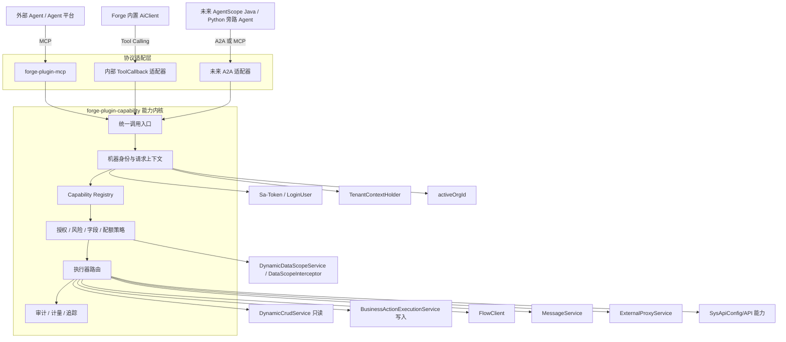

# Forge AI 中枢：落地架构与阶段路线图

> 本文是《Forge-AI中枢战略与技术选型方案》的工程落地配套稿，回答“基于当前 Forge 工程具体怎么建设、先做什么、分几期、每期如何验收”。
>
> 推荐结论：按 **5 个阶段**推进，其中阶段 0 是架构与依赖验证，阶段 1～3 形成可商用的 AI 中枢主链路，阶段 4 再建设 Agent 运行时、RAG 和多智能体。按 3～4 人核心团队估算，30 天形成受限内网 Alpha，6～8 周形成安全的只读试点，4～6 个月可达到企业试点版本。

> **当前进度（2026-07-10）**：已完成阶段 0 的一个前置变更——Spring AI Alibaba 供应商适配层与 DashScope 原生接入。完整阶段 0 的 MCP Spike、能力模型和机器安全边界仍未完成，阶段 1～4 也尚未开始。

---

## 1. 先修正原三阶段方案的实施顺序

原方案的战略判断和 JVM 技术路线是正确的，但工程实施不能直接从“把 Service 包成 MCP Tool”开始。原因是当前 Forge 的权限、租户、组织、数据范围和业务状态约束都依赖请求上下文；如果先暴露工具，再补机器身份和治理，会得到一个能演示、但不能安全开放的接口层。

建议把原来的三个大阶段细化成五个可独立验收的阶段：

| 阶段 | 建设主题 | 预计周期 | 可交付结果 |
|---|---|---:|---|
| 阶段 0 | 架构定版与技术 Spike | 2 周 | 证明当前 Spring AI 版本可承载 MCP，冻结能力模型和安全边界 |
| 阶段 1 | 能力内核 + 只读 MCP MVP | 4～6 周 | 外部 Agent 可在授权租户/组织内发现并查询 Forge 业务数据 |
| 阶段 2 | 受控写入 + 流程闭环 | 6～8 周 | Agent 可通过已发布业务动作安全修改数据、发起/办理流程 |
| 阶段 3 | 开放平台 + 企业治理 | 6～8 周 | 客户端、授权、配额、审计、版本、可观测形成企业产品闭环 |
| 阶段 4 | Agent 运行时 + RAG + 评估 | 8～12 周起 | Forge 内部 Agent 真正消费能力目录，按需引入 AgentScope Java |

阶段 0～1 是社区版/技术预览边界，阶段 0～3 是企业版主链路，阶段 4 属于平台版增值能力。

---

## 2. 当前工程真实基础与需要纠偏的判断

### 2.1 可以直接复用的主干

| 现有资产 | 当前工程位置 | AI 中枢中的角色 |
|---|---|---|
| 已发布低代码运行配置 | `AiCrudConfig`、`LowcodeRuntimeConfigBuilder` | 只读数据工具 Schema 和运行约束的主要事实来源 |
| 动态 CRUD | `DynamicCrudService` / `DynamicCrudController` | 查询、详情等数据能力执行器 |
| 业务对象与动作 | `AiBusinessObject`、`BusinessObjectActionService` | 语义化工具目录和可发布业务动作来源 |
| 通用动作执行 | `BusinessActionExecutionService` | 写工具的首选执行边界，已具备权限、幂等和执行日志 |
| 流程 | `FlowClient` | 发起、待办、详情、通过、驳回等流程能力适配器 |
| 消息 | `MessageService` | 模板化消息能力适配器 |
| 外部系统代理 | `ExternalProxyService` | 受治理的外部集成能力适配器，不应直接裸露任意 HTTP |
| API 配置 | `SysApiConfig` / `IApiConfigManager` | API 类能力的一个来源，不是完整 Capability Registry |
| 用户安全上下文 | `LoginUser` / `SessionHelper` | 复用权限、租户、当前组织和数据范围的关键入口 |
| 租户与数据权限 | `TenantContextHolder`、`DynamicDataScopeService`、`DataScopeInterceptor` | 按执行器复用不同权限路径，能力调用必须统一 fail-closed |
| AI 调用 | `AiClient` / `AiClientImpl` | 后续内部 Agent 消费能力目录的模型调用层 |

### 2.2 当前看似已有、实际还不能直接使用的能力

1. 当前依赖是 Spring Boot `3.5.13`、Spring AI `1.1.2`、Spring AI Alibaba/Extensions `1.1.2.3`。工程只引入 `spring-ai-alibaba-dashscope` 核心模型模块，没有引入 DashScope Starter，也没有引入 Nacos、Admin、MCP Registry 或 Agent Framework；MCP starter 的坐标和版本兼容性仍必须单独做 Spike。
2. 工程内没有 MCP Server、`ToolCallback` 或 Function Calling 注册链路。`AiClient` 当前只有 `call` 和 `stream`，不会读取或执行 Agent 配置里的工具。
3. `forge-admin-ui/src/views/ai/agent.vue` 中的 MCP 工具是“知识库检索、数据库查询、HTTP 请求、文件读取、工作流触发、代码执行”六个硬编码选项，只保存到 `extraConfig`，后端不消费。它目前是产品占位，不是已实现能力。
4. `SysApiConfig` 有鉴权、加密、租户、限流等开关，但自动注册器和启动注册逻辑被关闭，`limitFlag` 没有对应执行器；同时它缺少输入/输出 Schema、风险等级、版本、客户端授权和调用审计，不能直接充当能力目录。
5. `LowcodeModelSchema` 是设计模型的一部分，但真正运行时还依赖 `AiCrudConfig.searchSchema/columnsSchema/editSchema/options`。工具生成必须以“已发布运行配置”为基准，不能直接把设计草稿变成外部工具。
6. 外部 MCP 调用本身不消耗 Forge 侧 LLM Token，阶段 1～3 应计量调用次数、耗时、并发、流量和下游成本；只有阶段 4 的内部 Agent 模型调用才统计 prompt/completion Token。两类账本不能混用。
7. 数据权限并非只有一条链路：动态 CRUD 使用 `NamedParameterJdbcTemplate + DynamicDataScopeService`，普通 MyBatis Mapper 才使用 `DataScopeInterceptor`。后者在缺失上下文或 SQL 改写失败时存在放行分支，外部能力不能把它直接视为最终安全边界。

`FlowClient`、`MessageService` 和 `ExternalProxyService` 的“复用”均指通过受限适配器复用。它们原始方法仍可能接受 `userId`、接收人或外部请求配置，不能直接注册为 Tool。

### 2.3 已完成的供应商适配前置项

`spring-ai-alibaba-provider-adapter` 已通过依赖树、后端测试、主应用装配、Flyway 静态检查和前端构建验证，结论如下：

- Spring AI Alibaba 是 Spring AI 的增强层，不替换 Spring AI 的统一 `ChatModel/ChatClient` 抽象；
- 版本基线固定为 Spring AI `1.1.2`、Spring AI Alibaba/Extensions `1.1.2.3`；
- 多租户 API Key 来自数据库，运行时直接构建 DashScope 核心模型，不启用读取全局 API Key 的 DashScope Starter 自动配置；
- 底层协议只由 `ai_provider.adapter_code` 路由，当前稳定值为 `openai_compatible`、`dashscope_native`，不得根据品牌或 URL 猜测；
- 历史供应商继续使用 `openai_compatible`，不会在迁移时自动改变协议、地址或计费路径；
- 该变更只解决模型供应商扩展性，不等价于 Capability Registry、MCP、Nacos/Admin 或 Agent Runtime 已完成。

应用回退采用前向兼容策略，不删除 `adapter_code` 字段或字典。部署不识别 Native Adapter 的旧应用前，必须先查询 `ai_provider`：如果存在 `dashscope_native` 记录，管理员要逐条切换为 `openai_compatible`、恢复对应的 Compatible Base URL/配置并通过连接测试；确认不存在 Native 记录后才能部署旧应用，否则旧代码会把原生 DashScope URL 当成 OpenAI Compatible 地址调用。

---

## 3. 目标架构

### 3.1 总体分层



### 3.2 两个新增模块的职责

#### `forge-plugin-capability`

这是协议无关的能力内核，不能放进 `forge-plugin-mcp`。否则后续内部 Function Calling、A2A 或其它协议会重复实现授权、审计和执行逻辑。

主要职责：

- 统一能力定义、版本、发布状态和来源映射；
- 从已发布低代码对象、业务动作、流程、消息和 API 配置生成能力；
- 提供 `BusinessCapabilityProvider` SPI，让代码优先业务显式注册查询和动作契约；
- 解析机器客户端为 Forge 用户/租户/当前组织上下文；
- 执行授权、字段过滤、风险、配额、幂等和人工审批策略；
- 路由到现有业务 Service；
- 统一记录调用日志、耗时、结果和脱敏摘要。

#### `forge-plugin-mcp`

它只负责 MCP 协议，不承载业务规则：

- MCP Server 配置和传输端点；
- `tools/list`、`tools/call` 与 Capability Registry 的转换；
- MCP 错误与 Forge `CapabilityResult` 的协议映射；
- 会话级客户端身份传递；
- Spring AI MCP starter 的版本隔离。

### 3.3 模块依赖方向

推荐依赖方向如下：

```text
forge-admin-server
  ├── forge-plugin-mcp
  │     └── forge-plugin-capability
  │            ├── forge-plugin-generator
  │            ├── forge-flow-client
  │            ├── forge-plugin-message
  │            ├── forge-plugin-external
  │            └── forge-starter-api-config
  ├── forge-business-core（依赖 capability SPI 并注册代码业务 Provider）
  └── forge-plugin-ai（阶段 4 再依赖 capability 的内部 ToolCallback 适配）
```

`forge-plugin-capability` 不依赖 `forge-plugin-ai`，避免“业务能力依赖模型调用层”。能力可以脱离 LLM 单独测试、调用和治理。

---

## 4. 能力模型怎么设计

### 4.1 能力不是 Controller 的简单镜像

能力定义至少包含以下维度：

```text
Capability
├── identity: capabilityCode / protocolToolName / version / tenantId
├── source: sourceType / sourceKey / sourceVersion
├── contract: inputSchema / outputSchema / description
├── behavior: READ / ACTION / FLOW / MESSAGE / EXTERNAL
├── risk: R0 / R1 / R2 / R3
├── governance: visibility / publishStatus / enabled / deprecatedAt
└── policy: permission / fieldPolicy / quotaPolicy / approvalPolicy
```

风险等级建议：

| 等级 | 含义 | 默认策略 |
|---|---|---|
| R0 | 元数据发现、无业务数据 | 可按客户端授权直接调用 |
| R1 | 查询和详情读取 | 必须经过租户、组织、数据权限和字段脱敏 |
| R2 | 可逆或低风险业务写入 | 必须显式发布、授权、幂等、审计，可配置二次确认 |
| R3 | 资金、权限、删除、关键状态流转 | 不允许 Agent 直接完成，必须进入 Flowable 人工审批或人工确认 |

### 4.2 首批工具命名与边界

推荐使用稳定、语义化命名：

```text
capability.search
capability.describe

<domain>.<object>.search
<domain>.<object>.get
<domain>.<object>.action.<actionCode>

flow.todo.list
flow.task.get
flow.process.start
flow.task.approve
flow.task.reject

message.template.send
```

`capabilityCode` 是 Forge 内部稳定标识，可以使用点号表达层级；`protocolToolName` 是按协议/模型供应商约束生成的安全名称，首期按 `[A-Za-z0-9_-]` 且不超过 64 字符处理，超长名称使用可复现的哈希后缀。阶段 0 必须验证各目标 MCP/Function Calling 客户端的字符集和长度限制，不能假设二者相同。

首期明确禁止直接开放：

- 任意 SQL 或“数据库查询”工具；
- 任意 URL 的 HTTP 请求工具；
- 任意文件读取、文件路径访问；
- 任意代码或脚本执行；
- 原始 `update/delete` 动态 CRUD；
- DDL、导入、批量导出；
- 未经白名单的外部代理接口。

因此，智能体页面当前硬编码的 `database_query/http_request/file_reader/code_executor` 不应直接实现，应改为从 Capability Registry 动态加载已授权工具。

`tools/list` 也不能把全租户的全部业务对象一次性返回。它只返回当前客户端已授权、已启用、已固定到工具集的能力，并支持游标分页。MCP 客户端调用 `capability.search/describe` 时也只能看到自身已授权能力；“授权前发现”只存在于同租户管理端，并按 `PRIVATE/DISCOVERABLE` 可见性控制，不能向机器客户端或其它租户泄露能力名称、字段和业务模型。阶段 0 的 Spike 必须验证 Spring AI MCP 实现能否按客户端动态过滤工具列表。

`visibility` 默认 `PRIVATE`。只有具备 AI 中枢能力发布权限的同租户管理员可以改为 `DISCOVERABLE`；修改必须审计并经过发布检查。`DISCOVERABLE` 只表示同租户管理端可申请授权，不代表机器客户端可调用或可读取完整 Schema。

### 4.3 低代码如何“发布即产出工具”

工具生成事件放在业务对象发布成功之后：

```text
业务对象设计
  → 发布检查
  → LowcodeRuntimeConfigBuilder 生成 AiCrudConfig
  → CapabilitySource 同步已发布版本
  → Schema Builder 生成工具契约
  → 管理员审核并发布能力
  → 客户端授权后出现在 tools/list
```

发布事件负责实时同步，同时保留一个按租户和来源校验 `sourceVersion/schemaChecksum` 的周期性对账任务，修复事件丢失或历史数据导入造成的目录漂移。

Schema 生成规则：

- 查询字段来自已发布 `searchSchema`，禁止客户端传任意列名和 SQL；
- 返回字段来自已发布 `columnsSchema/editSchema` 与字段策略的交集；
- 分页固定使用 `pageNum/pageSize`，并设置服务端最大页大小；
- 排序字段必须在允许列表内；
- 主键统一按字符串暴露，避免雪花 ID 被 JavaScript `Number` 截断；
- 字典、引用字段同时返回稳定值和允许公开的展示值；
- 敏感、加密、内部、审计字段默认不进入 Schema；
- 仅 `publishStatus=PUBLISHED` 且对象未停用的配置可生成外部能力。

不同来源的契约必须有明确事实来源：

| 能力来源 | input/output Schema 的事实来源 | 无契约时的处理 |
|---|---|---|
| 低代码查询/详情 | 已发布 `AiCrudConfig` + `searchSchema/columnsSchema/editSchema/modelSchema/options` 快照 | 不生成工具 |
| 业务动作 | 新增的已发布 `inputContract/outputContract` 动作快照 | 动作仍可供页面使用，但不对 Agent 发布 |
| 代码业务 | `BusinessCapabilityProvider` 显式返回的版本化契约 | 不自动从 `BusinessCodeFormProvider` 表单推导 |
| 流程 | 平台固定动作契约 + 已发布流程变量映射/节点可写字段快照 | 变量只允许契约内字段，不能传任意 Map |
| 消息 | 已发布消息模板变量 Schema + 接收人解析策略 | 无变量契约或可任意选接收人时不发布 |
| REST API | OpenAPI/JSON Schema 契约快照，与 `SysApiConfig.apiCode` 关联 | 仅有 URL/Method 的 API 不自动发布 |
| 外部代理 | 已审核的外部接口请求/响应 Schema 与目标白名单 | 禁止退化为任意 URL/Header/Body 代理 |

能力内核的规范契约采用 JSON Schema Draft 2020-12，并固定 `additionalProperties=false`；低代码字段映射在阶段 1 固化为 `schemaVersion=1`：字段必填映射到 `required`，可空性映射为 `null` 联合类型，雪花/Long ID 映射为带格式说明的字符串，主子表映射为对象加明细数组，字典映射为枚举值并在输出中附展示字段，引用字段映射为稳定 ID 与允许公开的显示值。不能识别的组件类型默认拒绝发布，而不是降级成任意 JSON。

MCP/Function Calling 适配器只投影各目标客户端共同支持的子集。阶段 0 必测 `required`、联合空类型、枚举、嵌套对象、明细数组、`additionalProperties` 和最大名称/嵌套深度；客户端不支持联合空类型时转换为“可省略的非空字段”，无法无损表达的契约对该协议标记为 `UNSUPPORTED`，禁止退化为自由对象。

每次发布都生成不可变 `ai_capability_version` 快照和 `schemaChecksum`。兼容性最低规则为：新增可选输入字段通常兼容；删除/改名字段、可选改必填、收窄枚举、改变字段类型或删除输出字段均视为破坏性变更，必须生成新的主版本。授权可以选择固定版本或跟随同主版本最新版本，回滚只切换当前版本指针，不修改历史快照。

### 4.4 写能力必须走业务动作，不直接走原始 CRUD

当前工程已经有 `BusinessActionExecutionService`，具备权限检查、幂等键、步骤执行、事务和动作日志。它比直接调用 `DynamicCrudService.updateById/deleteById` 更适合作为 Agent 写入边界。

采购审批这类代码优先业务不能从 `BusinessCodeFormProvider` 自动推导工具。该 Provider 的职责是流程表单上下文；代码业务应单独实现 `BusinessCapabilityProvider`，显式声明输入/输出 Schema、风险和执行方法，避免把页面表单协议错误地当成业务 API 契约。

写工具规则：

1. 只有在业务对象设计器中显式启用、发布的动作才生成工具；
2. 发布时把动作配置写入版本化快照，能力执行只能读取已发布快照，不能直接读取尚未发布的 `AiBusinessObject.designerOptions` 草稿；
3. 工具权限复用 `BusinessObjectActionVO.permission`；
4. 每次写调用必须携带 `idempotencyKey`；
5. 调用者不能传 `tenantId/userId/activeOrgId`，这些值必须从机器身份派生；
6. R3 动作只创建审批请求并返回 `PENDING_APPROVAL`，不直接执行副作用；
7. 删除默认不生成工具，确需开放时必须写入 Spec，并提供恢复和回滚方式。

### 4.5 统一返回协议

业务执行结果在进入 MCP 前统一为协议无关结构：

```json
{
  "requestId": "...",
  "capabilityCode": "purchase.order.action.submit",
  "status": "SUCCESS | FAILED | PENDING_APPROVAL",
  "data": {},
  "approvalRequestId": null,
  "errorCode": null,
  "message": "",
  "durationMs": 0
}
```

MCP、内部 Tool Calling 和未来 A2A 只负责映射这个结果，不重复定义业务返回语义。

### 4.6 R3 人工审批不是普通异步调用

R3 调用必须形成可恢复、一次性执行的状态机：

```text
参数校验
  → 按 tenantId + clientId + capabilityId + idempotencyKey 原子预占 RESERVED 记录
  → 固化 capabilityVersion + 身份 + 规范化请求快照
  → 敏感请求信封加密保存并计算 SHA-256 摘要
  → 创建 ai_capability_approval 与专用 Flowable 审批实例
  → 返回 PENDING_APPROVAL
  → 审批回调按 approvalId 加锁
  → 重新校验客户端状态、grant、服务账号、能力版本和当前业务状态
  → 使用原 idempotencyKey 执行一次
  → 保存 SUCCESS / FAILED / EXPIRED / CANCELLED 终态
```

`ai_capability_approval.idempotency_key` 必须非空，建立 `(tenant_id, client_id, capability_id, idempotency_key, logic_delete_active)` 唯一约束。先以独立短事务插入 `RESERVED`，再使用 `capability-approval:{approvalId}` 作为 Flowable businessKey 创建流程；并发重复请求命中唯一键后返回同一个 `approvalRequestId`，不得再次启动流程。

审批请求快照使用信封加密：每条记录生成独立 AES-256-GCM DEK，记录必须保存 `keyId/wrappedDek/iv/ciphertext/authTag`；DEK 由密钥管理系统或部署环境 Secret 中的 KEK 包装为 `wrappedDek`，解密时先按 `keyId` 取得 KEK 并解包 DEK。KEK 禁止写入数据库和代码。密钥轮换后旧 `keyId` 在审批与审计留存期内保持可解密，灾备必须同时备份密文、`wrappedDek` 和受控密钥材料。若当前部署没有 KMS，先实现 `CapabilityPayloadCrypto` 抽象并使用外部 Secret 管理的版本化 KEK，不能复用前端报文加密密钥。

审批页面展示请求摘要、变更前后值、风险说明和调用来源；审批通过不能直接信任旧权限快照。回调重复、消息重投和 Agent 轮询均不得重复执行。审批过期、客户端吊销、能力下线、业务状态已变化或重新授权失败时，审批记录终止，不自动降级执行。

---

## 5. 身份、租户和权限设计

### 5.1 机器客户端不能成为超级管理员捷径

每个机器客户端必须绑定：

- 一个租户 `tenantId`；
- 一个专用服务账号 `serviceUserId`；
- 一个当前组织 `activeOrgId`；
- 一个能力授权集合；
- 有效期、状态和密钥轮换信息。

首期可以用“API Key 换短期访问令牌”的方式落地：客户端密钥只在创建时展示一次，数据库只保存哈希和前缀；换发的短期令牌标记为 `agent-client` 设备，只允许访问 MCP/AI 中枢端点。服务账号对应的 `LoginUser` 继续驱动现有权限、组织和数据范围。

正式企业版再提供标准 OAuth2 Client Credentials。不要在第一期同时自研完整 OAuth2 授权服务器和 MCP 能力内核。

机器认证的可执行算法如下：

1. 校验客户端状态、有效期、密钥版本和租户状态；API Key 使用至少 256 bit 随机数，数据库保存 `keyPrefix + HMAC-SHA-256(key, serverPepper)`，比较使用常量时间算法；
2. 每次换发短期令牌时调用现有 `IUserLoadService.loadUserByUserId(serviceUserId, tenantId, activeOrgId)` 重建 `LoginUser`，不信任客户端表中的角色/权限快照；
3. 严格校验用户启用、未删除、租户成员有效、返回租户与绑定租户一致、返回 `activeOrgId` 与绑定组织完全一致；现有加载逻辑在组织不匹配时可能回退主组织，机器认证层必须额外拒绝这种回退；
4. 禁止绑定超级管理员；服务账号无组织、无启用角色或被要求强制改密时默认拒绝换发；
5. 令牌写入 `LoginUser` Session，并带 `device=agent-client`、`audience=forge-mcp`、`clientId`、`credentialVersion` 和短 TTL；
6. MCP 每次请求重新校验令牌 audience、客户端未吊销和 credentialVersion，确保密钥轮换/吊销能立即失效；
7. 最终授权是 `客户端 grant ∩ 服务账号权限 ∩ 数据范围 ∩ 字段策略 ∩ 风险策略`，任何一项缺失均拒绝；
8. 请求结束只恢复/清理当前线程的 Sa-Token 请求绑定、租户、组织、数据权限和审计/MDC 上下文，不能调用 `SessionHelper.clearSession()`、注销短期令牌或清空持久 Token Session；异步任务使用显式快照传播并在 finally 中恢复线程上下文。

### 5.2 请求上下文规则

- `tenantId`、`serviceUserId`、`activeOrgId` 只能来自认证结果；
- MCP 参数中出现这些字段时应拒绝或忽略，而不是覆盖上下文；
- 进入执行器前同时设置用户 Session 与 `TenantContextHolder`；
- 异步执行必须传播并最终清理租户、用户、组织和审计上下文；
- 动态低代码查询必须向 `DynamicDataScopeService.buildCondition(..., explicitContext)` 传入已验证上下文；对外能力未配置 `FOLLOW_SYSTEM` 或显式外部数据策略时拒绝发布；
- `DynamicDataScopeService` 的 REGION 规则必须先整改：行政区划及下级编码从平台主库的数据权限快照/缓存解析，业务 SQL 只生成参数化 `IN (:regionCodes)`，禁止在租户业务库中子查询 `sys_region_code`；
- MyBatis 能力适配器必须启用“capability fail-closed”模式：上下文缺失、Mapper 未配置权限、未知范围或 SQL 改写失败均抛错，不能沿用后台任务的跳过逻辑；
- 代码业务 Provider 必须在契约中声明权限策略，并由能力层先校验；Provider 内部仍保留业务对象级授权，形成双重校验；
- `BusinessActionExecutionService` 当前在缺失租户时回退 `tenantId=1`，机器调用必须在进入该服务前强制验证非空上下文，后续应移除这类对外链路的默认租户兜底；
- 不另造一套角色/组织模型，但要按执行器选择正确的数据权限实现；
- 超级管理员服务账号默认禁止创建，确需使用必须有平台级显式开关和专项审计。

### 5.3 阶段 1 的最低网络与凭据安全基线

- 除本机 Spike 外强制 TLS，试点环境优先放在网关/VPN/内网白名单之后；
- API Key 只允许换取访问令牌，不能直接调用业务工具；
- 访问令牌 TTL 不超过 15 分钟，并校验 audience、device、clientId 和 credentialVersion；
- 凭据换发接口按客户端/IP 限流，连续失败锁定并产生安全告警；
- 支持客户端与密钥立即吊销，缓存最长生效时间必须小于 1 分钟；
- 禁止在日志、错误消息、调用摘要中记录 API Key、令牌、完整业务参数和未脱敏字段；
- 阶段 1 只读调用仍记录时间戳、requestId 和客户端会话，阶段 2 写调用再强制 nonce/idempotencyKey 与重放保护；
- 公网试点至少启用固定出口 IP 白名单；mTLS、标准 OAuth2 和细粒度网络策略在阶段 3 产品化。

---

## 6. 建议的数据表

阶段 1 先落五张主表，版本快照不能推迟到写能力之后：

| 表 | 作用 |
|---|---|
| `ai_capability` | 协议无关的能力定义、来源、当前版本、`PRIVATE/DISCOVERABLE` 可见性、风险和发布状态 |
| `ai_capability_client` | 机器客户端、密钥哈希、服务账号、租户、当前组织、有效期 |
| `ai_capability_grant` | 客户端到能力的显式授权和字段/操作范围 |
| `ai_capability_invocation_log` | 请求 ID、客户端、能力、耗时、结果、脱敏摘要、错误与 traceId |
| `ai_capability_version` | 不可变 input/output Schema、来源版本、策略摘要和校验和快照 |

阶段 2 再增加：

| 表 | 作用 |
|---|---|
| `ai_capability_policy` | 限流、并发、字段、风险和人工审批策略 |
| `ai_capability_approval` | R3 调用、非空幂等键、信封加密快照、密钥版本与 Flowable 审批实例的关联 |

阶段 3 再增加用量聚合表：

| 表 | 作用 |
|---|---|
| `ai_capability_usage_daily` | 按租户、客户端、能力聚合的日调用量、成功量和耗时 |

配置类表按 Forge 业务表规范补齐审计字段和 `del_flag`。调用日志属于可审计数据，普通删除走逻辑删除；超期数据只允许由明确的留存清理任务物理清理。

`SysApiConfig` 不扩成万能大表。它继续管理 REST 接口行为，`ai_capability.sourceType=API`、`sourceKey=apiCode` 与它建立来源关系。

---

## 7. 五阶段具体实施内容

### 阶段 0：架构定版与技术 Spike（2 周）

#### 目标

用最小代码证明 MCP 技术链路与当前 Spring Boot/Spring AI 依赖兼容，同时冻结后续不会轻易变化的领域模型。

#### 当前状态

供应商适配前置项已经完成：依赖基线、DashScope Core、显式 Adapter 路由和统一调用链均已验证。下列 MCP Spike、能力模型与机器身份工作仍是阶段 0 的待办，不能据此把阶段 0 标记为完成。

#### 工作项

1. 创建 SDD 变更 `forge-ai-hub-foundation`，明确能力模型、身份模型、风险等级和非目标。
2. 对 Spring AI `1.1.2` 与当前 Boot `3.5.13` 做 MCP Server 依赖 Spike；只实现内存 `capability.ping` 和一个静态只读工具。
3. 验证 WebMVC/现有 WebFlux 依赖共存、SSE/Streamable HTTP、Undertow、请求级 Sa-Token 认证、按客户端动态 `tools/list` 和游标分页。
4. 定义 `CapabilityDefinition`、`CapabilityInvocation`、`CapabilityResult`、`CapabilityExecutor`、`CapabilitySource` 五个核心接口。
5. 冻结内部 `capabilityCode` 到协议安全 `protocolToolName` 的映射、错误码、风险等级、Schema 版本和请求 ID 规则。
6. 验证 Draft 2020-12 到目标 MCP/Function Calling 客户端的公共子集和降级/拒绝规则。
7. 为动态 CRUD、MyBatis、代码 Provider 三类执行器分别定义 fail-closed 权限契约，并把 REGION 业务库子查询列为阶段 1 阻断整改。
8. 把智能体页 MCP 选项明确标记为“预留”或暂时隐藏，避免产品误导。

#### 退出闸门

- MCP 客户端可以发现并调用静态只读工具；
- Spike 不接业务数据库写操作；
- Maven 依赖树无 Spring AI 版本冲突；
- 已验证 Streamable HTTP/SSE 每次请求都能识别并隔离客户端身份；
- 已验证工具名称约束、动态工具过滤和分页在目标 MCP 客户端可用；
- 已验证 required、联合空类型、枚举、嵌套对象、明细数组和 `additionalProperties` 的协议投影；
- 形成明确 ADR：继续 `1.1.2`、小版本升级，或单独升级 Spring AI；
- 核心接口评审通过后才进入阶段 1。

### 阶段 1：能力内核 + 只读 MCP MVP（4～6 周）

#### 目标

交付第一个可以给真实 Agent 试用、但只读且安全隔离的版本。

#### 工作项

1. 新建 `forge-plugin-capability` 和 `forge-plugin-mcp`，接入 `forge-plugin-parent` 与 `forge-admin-server`。
2. 建立阶段 1 的五张表、Mapper XML、Service、Controller 和 Flyway 迁移。
3. 实现 `LowcodePublishedCapabilitySource`：只读取已发布 `AiCrudConfig`，生成查询和详情能力。
4. 实现 `PublishedCrudSchemaBuilder`：从运行态 Schema 生成 JSON Schema，并过滤内部/敏感/不可查询字段。
5. 实现 `DynamicCrudReadExecutor`，只开放分页查询和详情，不开放树写入、导入、导出和删除。
6. 整改 REGION 数据权限：从平台主库快照/缓存解析区域及下级编码，生成参数化 `IN` 条件，禁止业务库 SQL 引用 `sys_region_code`。
7. 实现发布事件同步与 `sourceVersion/schemaChecksum` 周期对账。
8. 按机器认证算法实现客户端密钥、短期令牌、服务账号实时加载、组织精确校验、立即吊销和 MCP 路径限制。
9. 实现授权交集、按执行器 fail-closed 数据权限、输出字段过滤、脱敏和调用日志。
10. 实现 `capability.search`、`capability.describe` 和按客户端过滤的 `tools/list`。
11. 前端新增 AI 中枢基础页面：能力目录、客户端、授权、调用日志。
12. 选一个已发布主子表对象作为验收样板，优先使用采购单/采购明细，不为样板硬编码业务逻辑。

#### 退出闸门

- 外部 MCP 客户端可以发现、查询、查看一个已发布业务对象；
- 未发布对象不会出现在目录；
- 不同客户端看到的工具列表按授权过滤；
- 跨租户、跨组织、超出数据范围、敏感字段访问均被阻止；
- 自动化安全用例中跨租户/组织泄露为 0，缺失上下文和权限计算异常均 fail-closed；
- 租户业务数据源的 REGION 查询 SQL 不包含 `sys_region_code` 等平台表，区域范围来自主库快照并通过参数绑定；
- 100% 调用有 `requestId/clientId/tenantId/activeOrgId/toolCode/result/duration` 审计记录，日志中密钥、令牌和敏感参数泄露为 0；
- 在测试环境 50 RPS、持续 10 分钟、至少 30 个授权工具的基线下，能力网关自身新增 p95 延迟不高于 100ms，错误率低于 0.1%（不含下游业务失败）；
- 密钥吊销 1 分钟内生效，访问令牌 TTL 不超过 15 分钟；
- 上述闸门全部通过后才进入写能力建设。

### 阶段 2：受控写入 + 流程闭环（6～8 周）

#### 目标

让 Agent 从“会查”升级为“能安全办事”，但所有副作用都经过业务动作、权限、幂等和风险策略。

#### 工作项

1. 实现 `BusinessActionCapabilitySource`，从已发布业务动作生成写工具，不从原始 CRUD 自动生成写工具。
2. 增加业务动作发布快照，`BusinessActionCapabilityExecutor` 只执行与能力版本绑定的已发布动作，并复用 `BusinessActionExecutionService` 的权限、幂等、事务和动作日志。
3. 定义 `BusinessCapabilityProvider` SPI，让代码业务模块显式发布查询/动作契约；以采购审批 Provider 作为通用机制的验收实现。
4. 实现流程只读工具，再逐步开放 `start/approve/reject`；办理人从服务账号上下文派生，禁止参数伪造 `userId`。
5. 实现消息模板发送工具，只允许已启用模板和受控接收范围，不开放任意正文群发。
6. 增加 R2/R3 风险策略、幂等键、并发限制和调用确认。
7. 按 R3 状态机实现不可变加密请求快照、摘要、专用 Flowable 审批、回调重新授权、一次性恢复执行、过期/撤销和 `capability.approval.get` 查询工具。
8. 增加失败补偿、超时、重试边界；业务失败不能因传输重试产生重复副作用。
9. 在管理端提供业务动作的能力发布、风险分级和客户端授权配置；智能体页的工具配置继续标记为预留，直到阶段 4 接通真实 Tool Calling。

#### 退出闸门

- 同一幂等键 20 路并发调用只产生一次业务副作用和一条有效执行链；
- 没有显式业务动作的对象不会出现写工具；
- R3 操作无法由 Agent 直接完成；
- 服务账号没有办理权限时，流程通过/驳回被拒绝；
- R3 审批重复回调、客户端吊销、授权撤回、能力下线、审批过期和业务状态变化均不会绕过重新校验或重复执行；
- 工具调用、业务动作日志和流程实例可通过同一 requestId/correlationId 串联；
- 至少完成“查询采购单 → 提交业务动作 → 发起审批 → 查询审批状态”的端到端验收。

### 阶段 3：开放平台 + 企业治理（6～8 周）

#### 目标

把阶段 1～2 的工程能力产品化为可运营、可授权、可计量、可升级的企业开放平台。

#### 工作项

1. 完善 OAuth2 Client Credentials、密钥轮换、吊销、短期令牌和 IP/网络策略。
2. 增加按租户、客户端、能力的 QPS、并发、日调用量和失败熔断策略。
3. 完善阶段 1 已建立的版本治理：Schema 兼容性、灰度发布、废弃时间、固定/跟随版本授权和客户端升级提醒。
4. 聚合调用量、成功率、p95/p99、错误码、审批等待时长和下游依赖健康度。
5. 将 `SysApiConfig`、流程、消息、外部集成按 CapabilitySource 接入统一目录。
6. 提供客户端门户、能力授权矩阵、调用日志、配额和告警页面。
7. 定义社区版、企业版和平台版的功能开关与授权边界。
8. 只有在出现多实例注册发现、跨环境发布和统一治理的真实需求后，才在现有 Spring AI Alibaba 模型适配基线上继续引入 Nacos MCP Registry/Admin；当前 DashScope Core 接入不代表治理组件已经启用。

#### Nacos 引入闸门

满足以下至少两项再引入 Nacos 治理：

- MCP Server 需要独立多实例部署；
- 存在多个 Forge 服务共同发布能力；
- 需要跨环境/跨集群能力注册发现；
- 自研管理面已无法满足实例健康、路由和版本治理；
- 团队已经具备 Nacos 的生产运维能力。

#### 退出闸门

- 客户端可自助创建、轮换和吊销凭据；
- 100 路并发和多实例测试中，配额超发率低于 1%，吊销传播不超过 1 分钟；
- 能力升级不破坏仍在支持期内的客户端；
- 审计、告警、运营报表可以回答“谁在什么租户、以什么权限、调用了什么、结果如何”；
- 完成不少于 7 天的试点压测/浸泡，服务可用性不低于 99.9%（不含计划维护）；
- 企业安全评审无未处置高危项，并完成客户端吊销、能力回滚、下游超时和审计存储故障演练。

### 阶段 4：Agent 运行时 + RAG + 评估（8～12 周起）

#### 目标

在能力出口稳定后，建设 Forge 自身的 Agent 平台，而不是让 Agent 编排反过来阻塞能力开放。

#### 工作项

1. `AiClient` 通过 Capability Registry 选择工具、执行工具循环和记录模型/工具联合轨迹。
2. 建设知识库与 RAG，但文档检索必须继承租户、组织和文档 ACL，不能只做向量相似度。
3. 建立 Agent 版本、提示词版本、工具集合版本和回归评估数据集。
4. 建立成功率、工具选择正确率、无权限拦截率、幻觉率、成本和延迟评估。
5. 修正当前 `AiClientImpl` 在 info 日志输出完整 system/user prompt 的行为，改为可配置、脱敏摘要和 traceId，避免业务数据进入普通日志。
6. 当出现长任务恢复、沙箱、工作区、长期记忆或多 Agent A2A 的明确需求时，再引入 AgentScope Java。
7. Python 只作为特定算法/RAG/ML 旁路服务，通过 MCP/A2A 接入，不能绕过 Capability Registry 直连业务库。

#### AgentScope Java 引入闸门

满足以下任一强需求再引入：

- 单次任务跨分钟/小时并要求断点恢复；
- 需要隔离沙箱、工作区或长生命周期记忆；
- 需要多 Agent 分工、协商和 A2A；
- Spring AI Tool Calling 已无法清晰表达状态机；
- 已有稳定评估集能证明新运行时带来可量化收益。

#### 退出闸门

- 建立至少 50 个覆盖正常、越权、诱导和工具失败的回归场景；
- 已授权场景工具选择正确率不低于 90%，未授权/跨租户/高风险绕过拦截率为 100%；
- RAG 检索的租户、组织和文档 ACL 负向用例泄露为 0；
- 每个 Agent 版本都可追溯到模型、提示词、能力集合和评估结果，未达阈值不能发布。

---

## 8. 建议的工程文件落点

阶段 1 预计涉及的主要位置：

```text
forge-server/
├── pom.xml                                      # 管理 MCP/Spring AI 兼容版本
├── forge-admin-server/pom.xml                   # 聚合 capability 与 mcp 插件
├── forge-framework/forge-plugin-parent/
│   ├── pom.xml                                  # 注册两个新模块
│   ├── forge-plugin-capability/
│   │   ├── controller/                          # 能力、客户端、授权、日志管理 API
│   │   ├── domain/                              # Capability/Client/Grant/InvocationLog
│   │   ├── dto/ vo/ mapper/ resources/mapper/  # 标准分层与 XML SQL
│   │   ├── registry/                            # 目录同步、版本、来源解析
│   │   ├── policy/                              # 授权、字段、风险、配额策略
│   │   ├── executor/                            # 统一执行入口与适配器
│   │   └── context/                             # 机器身份和调用上下文
│   └── forge-plugin-mcp/
│       ├── config/                              # MCP Server 自动配置
│       ├── transport/                           # MCP 协议映射
│       └── provider/                            # Registry → ToolCallback/Tool 定义
└── db/migration/                                # 按执行时最高版本顺延 Flyway 脚本

forge-admin-ui/src/
├── api/ai-hub.js
└── views/ai-hub/
    ├── index.vue                                # 总览
    ├── capability.vue                           # 能力目录
    ├── client.vue                               # 机器客户端
    ├── grant.vue                                # 授权矩阵
    └── invocation-log.vue                       # 调用审计
```

代码实现仍须遵守 Forge 规则：查询写在 Mapper XML；配置主表逻辑删除；业务内置数据 `tenant_id=1`；迁移使用 Flyway 且防重复；大改动先建 `spec.md/tasks.md/test-spec.md/execution-log.md`。

---

## 9. 测试策略

每阶段都要覆盖四类测试，不能只验证 MCP 客户端“调通”：

| 测试层 | 必测内容 |
|---|---|
| 契约测试 | JSON Schema、工具命名、版本兼容、错误码、分页和雪花 ID 字符串 |
| 安全测试 | 无凭据、过期凭据、越权能力、跨租户、跨组织、字段泄露、参数伪造 |
| 业务测试 | 数据权限、逻辑删除、字典/引用回显、业务动作权限、流程办理人、幂等 |
| 协议测试 | tools/list、tools/call、断线、超时、重试、并发、错误映射 |

阶段 2 起增加 Prompt Injection 和 Tool Misuse 测试：即使模型被诱导传入隐藏字段、其它租户 ID、任意 URL 或危险动作，能力内核也必须独立拒绝，不能依赖提示词自律。

---

## 10. 第一批 SDD 变更建议

不要用一个超大变更覆盖半年工作，建议按可运行软件拆分：

1. `forge-ai-hub-foundation`：依赖 Spike、核心接口、ADR、静态 MCP 工具；
2. `forge-ai-hub-readonly-mcp`：能力表、发布态 Schema、机器身份、查询/详情、审计；
3. `forge-ai-hub-secure-actions`：业务动作、流程、消息、风险、幂等、人工审批；
4. `forge-ai-hub-open-platform`：OAuth2、配额、版本、运营与可观测；
5. `forge-ai-hub-agent-runtime`：内部 Tool Calling、RAG、评估、按门槛引入 AgentScope Java。

每个变更必须独立可构建、可测试、可回滚，并在进入下一阶段前通过本阶段退出闸门。

---

## 11. 最值得先做的 30 天

### 第 1 周

- 创建 `forge-ai-hub-foundation` SDD；
- 完成 Spring AI MCP 依赖 Spike；
- 确定能力、身份、风险、返回协议 ADR。

### 第 2 周

- 创建 `forge-plugin-capability` 骨架；
- 落 `ai_capability`、版本快照、客户端、授权、调用日志模型；
- 完成已发布 `AiCrudConfig` 到只读 Capability 的转换。

### 第 3 周

- 完成查询/详情 Schema Builder 和执行器；
- 接入服务账号、租户、当前组织和数据权限；
- 完成字段过滤、敏感字段脱敏和审计。

### 第 4 周

- 接入 `forge-plugin-mcp`；
- 在测试环境用白名单 MCP 客户端验证 `search/get`；
- 做跨租户、跨组织、越权、雪花 ID 和分页上限测试；
- 用采购单主子表场景演示，但保持平台代码通用。

30 天结束时的正确结果是“受限内网/测试环境、单租户白名单 Alpha 已打通”，不是对外生产试点，更不是“Agent 已能任意操作 Forge”。继续完成凭据安全、负载、安全回归和运维闸门后，才在第 6～8 周进入真实只读试点；这条主链稳定后再开放写动作和流程。
