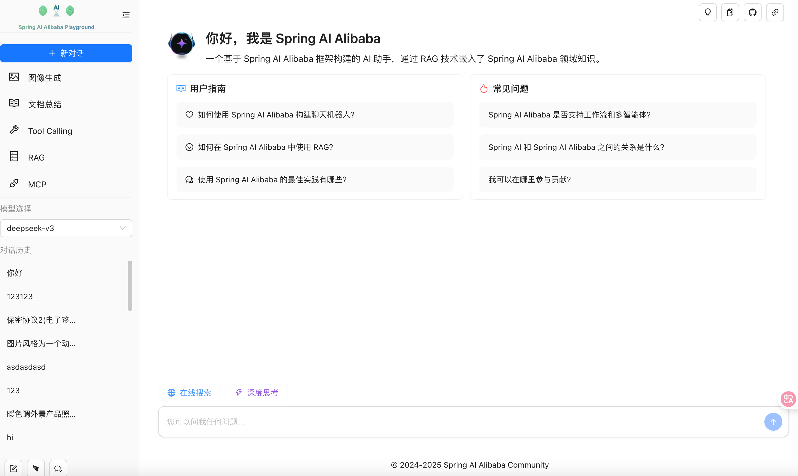

# Spring AI Alibaba 扩展

本项目基于 Spring AI 构建，提供了对核心概念的扩展实现，如 `ChatModel`、`ImageModel`、`AudioModel`、`MCP`、`DocumentParser`、`ChatMemory`、`ToolCallback`、`VectorStore` 等。帮助开发者快速集成阿里云百炼模型服务、向量数据库服务、聊天记忆组件、工具调用等功能。

基于这些组件，开发者可以使用 Spring AI [ChatClient](https://java2ai.com/docs/1.0.0.2/tutorials/basics/chat-client/)，或 [Spring AI Alibaba Agent 框架](https://github.com/alibaba/spring-ai-alibaba) 快速构建自己的 AI 智能体应用。请根据您的具体使用场景选择。

[📖 English Version](README.md) | [中文版](README-zh.md)

## 快速开始

### 前置条件

1. 需要 JDK 17+
2. 如果遇到任何 `spring-ai` 依赖问题，请查看 [FAQ 页面](https://java2ai.com/docs/1.0.0.2/faq) 了解如何配置 `spring-milestones` Maven 仓库

### 使用 `ChatClient` 开发聊天机器人

#### 添加依赖
要快速开始使用 Spring AI Alibaba，请在您的 Java 项目中添加 `spring-ai-alibaba-starter-dashscope` 依赖。

```xml
<dependencyManagement>
  <dependencies>
    <dependency>
      <groupId>com.alibaba.cloud.ai</groupId>
      <artifactId>spring-ai-extensions-bom</artifactId>
      <version>1.1.2.0</version>
      <type>pom</type>
      <scope>import</scope>
    </dependency>
  </dependencies>
</dependencyManagement>

<dependencies>
  <dependency>
    <groupId>com.alibaba.cloud.ai</groupId>
    <artifactId>spring-ai-alibaba-starter-dashscope</artifactId>
  </dependency>
</dependencies>
```

如需使用基于 DashScope Java SDK 的聊天模型实现，可改用 SDK starter：

```xml
<dependency>
  <groupId>com.alibaba.cloud.ai</groupId>
  <artifactId>spring-ai-alibaba-starter-dashscope-sdk</artifactId>
</dependency>
```

并配置 `spring.ai.model.chat=dashscope-sdk`。

#### 声明 ChatClient
声明一个 `ChatClient` 实例，将会自动注入 `DashScopeChatModel`。

```java
@RestController
@RequestMapping("/helloworld")
public class HelloworldController {
  private static final String DEFAULT_PROMPT = "你是一个博学的智能聊天助手，请根据用户提问回答！";
  private final ChatClient dashScopeChatClient;

  public HelloworldController(ChatClient.Builder chatClientBuilder) {
    this.dashScopeChatClient = chatClientBuilder
        .defaultSystem(DEFAULT_PROMPT)
        .defaultAdvisors(
            new SimpleLoggerAdvisor()
        )
        .defaultOptions(
            DashScopeChatOptions.builder()
                .topP(0.7)
                .build()
        )
        .build();
  }

  @GetMapping("/simple/chat")
  public String simpleChat(@RequestParam(value = "query") String query) {
    return dashScopeChatClient.prompt(query).call().content();
  }
}
```

请访问我们官网的 [快速开始](https://java2ai.com/docs/1.0.0.2/get-started/chatbot) 了解更多详情。

### 使用 Agent 框架开发智能体

// 待补充

## 示例和演示

社区开发了一个包含完整前端 UI 和后端实现的 [Playground](https://github.com/springaialibaba/spring-ai-alibaba-examples/tree/main/spring-ai-alibaba-playground) 智能体。Playground 后端使用 Spring AI Alibaba 开发，让用户快速体验聊天机器人、多轮对话、图像生成、多模态、工具调用、MCP、RAG 等所有核心框架能力。

<p align="center">
    
</p>

您可以[本地部署 Playground 示例](https://github.com/springaialibaba/spring-ai-alibaba-examples)并通过浏览器访问体验，或复制源代码并调整到您自己的业务需求，更快速地构建自己的 AI 应用套件。
更多示例请参考我们的官方示例仓库：[https://github.com/springaialibaba/spring-ai-alibaba-examples](https://github.com/springaialibaba/spring-ai-alibaba-examples)

## 可用扩展

* 模型 (Model)
* 模型上下文协议 (MCP)
* 工具回调 (ToolCallback)
* 向量存储 (VectorStore)
* 聊天记忆 (ChatMemory)
* 检索增强生成 (RAG)
* 文档解析器和文档读取器 (DocumentParser & DocumentReader)
* 提示词管理 (Prompt Management)
* 观测和监控 (Observation)

### 模型

Spring AI Alibaba 通过 DashScope（阿里云 AI 模型服务平台）提供全面的模型实现：

#### DashScopeChatModel

DashScope 聊天模型提供对阿里云百炼大语言模型服务的访问，支持 Qwen 系列、Deepseek 系列模型。

DashScopeChatModel 支持：
- 多轮对话
- 函数调用 / 工具使用
- 流式响应
- 结构化输出

#### DashScopeSdkChatModel

基于 DashScope Java SDK 的聊天模型实现。使用 `spring-ai-alibaba-starter-dashscope-sdk` 并配置 `spring.ai.model.chat=dashscope-sdk` 即可启用。

#### DashScopeSdkImageModel

基于 DashScope Java SDK 的图像模型实现。使用 `spring-ai-alibaba-starter-dashscope-sdk` 并配置 `spring.ai.model.image=dashscope-sdk` 即可启用。

#### DashScopeSdkEmbeddingModel

基于 DashScope Java SDK 的向量模型实现。使用 `spring-ai-alibaba-starter-dashscope-sdk` 并配置 `spring.ai.model.embedding=dashscope-sdk` 即可启用。

#### DashScopeSdkAudioSpeechModel

基于 DashScope Java SDK 的语音合成模型实现。使用 `spring-ai-alibaba-starter-dashscope-sdk` 并配置 `spring.ai.model.audio.speech=dashscope-sdk` 即可启用。

#### DashScopeSdkAudioTranscriptionModel

基于 DashScope Java SDK 的语音识别模型实现。使用 `spring-ai-alibaba-starter-dashscope-sdk` 并配置 `spring.ai.model.audio.transcription=dashscope-sdk` 即可启用。

#### DashScopeImageModel

基于 DashScope 的图像生成能力，支持文本到图像的生成，具有多种风格和参数。

#### DashScopeEmbeddingModel

文本嵌入模型，用于将文本转换为向量表示，是 RAG（检索增强生成）应用和语义搜索的核心组件。

#### DashScopeAudioSpeechModel

文本转语音合成模型，将文本转换为自然语音，支持多种声音和语言。

#### DashScopeAudioTranscriptionModel

语音转文本转录模型，以高精度将音频转换为文本。

### MCP (模型上下文协议)

MCP 提供了一个标准化协议，用于管理和路由 AI 模型上下文。此扩展包括：

- **MCP Common**: 模型上下文协议的核心抽象和工具
- **MCP Gateway**: 统一的 MCP 服务网关，支持多协议和 OAuth 认证
- **MCP Registry**: 用于发现和管理 MCP 服务的注册中心
- **MCP Router**: 智能路由功能，用于在多个模型上下文之间分发请求

**MCP SDK 版本**: 0.14.0

**可用的 Starter：**
- `spring-ai-alibaba-starter-mcp-registry`
- `spring-ai-alibaba-starter-mcp-router`

### 工具回调

大量预构建的工具集成，使 AI 模型能够与外部服务和 API 交互。框架包含 40+ 个即用型工具：

**搜索和信息：**
- 百度搜索、Brave 搜索、DuckDuckGo、Metaso 搜索、Tavily 搜索、SerpAPI
- 维基百科、谷歌学术、OpenAlex
- 阿里云 AI 搜索

**翻译服务：**
- 阿里翻译、百度翻译、谷歌翻译、微软翻译、有道翻译

**地图和位置：**
- 高德地图、百度地图、腾讯地图、OpenTripMap、TripAdvisor

**新闻和媒体：**
- 新浪新闻、今日头条

**协作工具：**
- 钉钉、飞书
- GitHub 工具包、GitLab
- 语雀、Notion

**网页抓取：**
- Firecrawl、Jina Crawler

**数据和存储：**
- Memcached、Minio
- MongoDB、MySQL、Elasticsearch、SQLite

**学术和研究：**
- Arxiv、谷歌学术、OpenAlex、Semantic Scholar

**金融和数据：**
- Tushare（金融数据）
- 世界银行数据

**实用工具：**
- 时间、天气、快递100（物流追踪）
- JSON 处理器、正则表达式
- 敏感词过滤

**趋势分析：**
- 谷歌趋势

**专业工具：**
- Ollama 搜索模型
- Bilibili（视频平台）

每个工具都提供自动配置支持，可通过属性配置轻松启用。

### 向量存储

用于构建 RAG 应用和语义搜索功能的向量数据库集成：

- **AnalyticDB Store**: 阿里云 AnalyticDB 向量存储
- **OceanBase Store**: 支持向量的 OceanBase 分布式数据库
- **OpenSearch Store**: 阿里云 OpenSearch 向量搜索
- **TableStore Store**: 阿里云 TableStore 向量数据存储
- **Tair Store**: 阿里云 Tair（Redis 兼容）向量存储

所有向量存储都提供一致的 API：
- 嵌入存储和检索
- 相似度搜索
- 元数据过滤
- 批量操作

### 聊天记忆

多种存储后端，用于管理对话历史和长期记忆：

**短期记忆：**
- **Redis**: 高性能内存存储
- **Memcached**: 分布式内存缓存
- **JDBC**: 关系型数据库存储
- **MongoDB**: 基于文档的存储
- **Elasticsearch**: 支持全文搜索的记忆
- **TableStore**: 阿里云 TableStore

**长期记忆：**
- **Mem0**: 具有智能摘要和检索功能的高级长期记忆

可用的 Starter：
- `spring-ai-alibaba-starter-memory`（短期记忆）
- `spring-ai-alibaba-starter-memory-long`（长期记忆）
- 单独的存储后端 Starter（如 `spring-ai-alibaba-starter-memory-redis`）

### 检索增强生成 (RAG)

流行的 RAG 架构和各种可重用组件：

- **混合搜索**: 使用 BM25 和 KNN 搜索的混合检索器，采用倒数排名融合 (RRF)。目前支持 Elasticsearch。
- **[HyDE 搜索](https://arxiv.org/abs/2212.10496)**: 假设文档嵌入 RAG，使用假设文档嵌入来提高检索召回率和准确性

可用的 Starter：
```xml
<dependency>
    <groupId>com.alibaba.cloud.ai</groupId>
    <artifactId>spring-ai-alibaba-starter-rag</artifactId>
</dependency>
```

### 提示词

动态提示词管理和版本控制功能：

- **Nacos 提示词**: 在 Nacos 配置中心存储和管理提示词，支持：
  - 无需代码更改的动态提示词更新
  - 版本控制
  - 环境特定的提示词
  - 多租户支持

**Starter：**
```xml
<dependency>
    <groupId>com.alibaba.cloud.ai</groupId>
    <artifactId>spring-ai-alibaba-starter-nacos-prompt</artifactId>
</dependency>
```

### 文档解析器

支持各种格式的全面文档解析功能：

- **Apache PDFBox**: PDF 文档解析
- **BibTeX**: 参考文献文件解析
- **BSHtml**: 具有 BeautifulSoup 类似功能的 HTML 内容解析
- **Directory**: 批量目录解析
- **Markdown**: Markdown 文档解析
- **Multi-modality**: 多模态文档解析（文本、图像等）
- **PDF Tables**: 高级 PDF 表格提取
- **Tika**: Apache Tika 集成，支持 1000+ 种文件格式
- **YAML**: YAML 配置文件解析

### 文档读取器

适用于各种数据源和平台的专业文档读取器：

**归档和存储：**
- 归档文件（ZIP、TAR 等）
- 腾讯云 COS（云对象存储）

**学术和研究：**
- Arxiv 论文
- HuggingFace 文件系统

**协作平台：**
- Notion
- 语雀
- 飞书
- Obsidian
- OneNote
- GitBook

**代码仓库：**
- GitHub
- GitLab
- GPT 仓库加载器格式

**媒体：**
- Bilibili 文本
- YouTube 文本

**数据库：**
- Elasticsearch
- MongoDB
- MySQL
- SQLite

**通信：**
- 邮件（IMAP、POP3）
- Mbox 格式

**AI 数据：**
- ChatGPT 对话数据
- POI（兴趣点）数据

每个读取器都可以从其相应的源提取和构建内容，为 RAG 管道和 AI 处理做好准备。

### 观测和监控

ARMS（应用实时监控服务）集成，提供全面的 AI 应用可观测性：

- 请求/响应跟踪
- 性能指标
- 令牌使用跟踪
- 错误监控
- 成本分析

**Starter：**
```xml
<dependency>
    <groupId>com.alibaba.cloud.ai</groupId>
    <artifactId>spring-ai-alibaba-starter-arms-observation</artifactId>
</dependency>
```

## 贡献

我们欢迎贡献！请查看我们的贡献指南，并遵循每个模块 README 中概述的开发标准。

## 许可证

本项目在 Apache License 2.0 下许可 - 详见 LICENSE 文件。

## 社区与支持

- Spring AI Alibaba Agent 框架: [https://github.com/alibaba/spring-ai-alibaba](https://github.com/alibaba/spring-ai-alibaba)
- 文档: [https://java2ai.com](https://java2ai.com)
- 示例: [Spring AI Alibaba 示例](https://github.com/springaialibaba/spring-ai-alibaba-examples)
