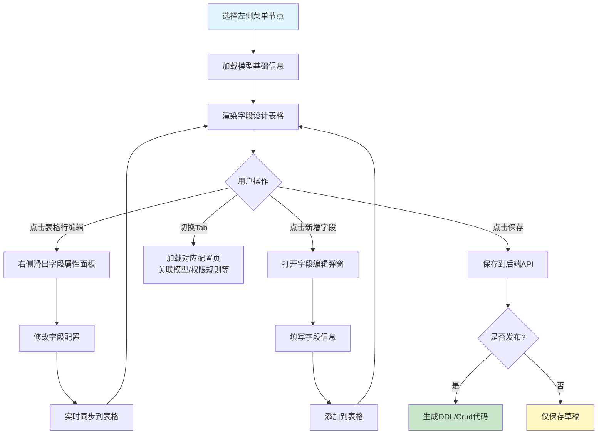

我来分析这个低代码平台模型详情页面的布局和交互逻辑。先看下你打开的文件上下文：


toolName: view_files

status: success


filePath: /Users/yaomindong/Desktop/project/asiainfo/psi/nmg-lt-psi-system/psi-system-server/psi-system-framework/psi-system-plugin-parent/psi-system-plugin-system/src/main/java/com/asiainfo/nm/psi/plugin/system/controller/SysCacheController.java

## 📊 低代码平台 - 模型详情页 布局与交互逻辑分析

根据你提供的截图，这是一个**数据模型设计器**的详情/编辑页面。以下是完整的布局结构和交互逻辑解析：

---

### 🎯 一、整体布局结构（4列式布局）

```
┌─────────────────────────────────────────────────────────────────────┐
│  顶部导航: Logo | 面包屑 | 搜索 | 预览/保存/发布按钮                │
├──────────┬──────────────────────────────────────────────────────────┤
│          │  ┌────────────┬───────────────────┬──────────────────┐   │
│  左侧菜单 │  │ 模型基础    │   字段设计表格     │  字段属性面板     │   │
│  (树形)   │  │  信息       │   (主工作区)      │  (右侧抽屉)      │   │
│  ~240px   │  │            │                   │                  │   │
│          │  ├────────────┴───────────────────┴──────────────────┤   │
│          │  │           ER 关系图 (可视化)                         │   │
│          │  ├─────────────────────────────────────────────────────┤   │
│          │  │  底部工具栏: 添加字段 | 导入 | 生成 | 保存 | 发布    │   │
└──────────┴──────────────────────────────────────────────────────────┘
```

---

### 📋 二、各区域详细分析

#### 1️⃣ **顶部导航栏**
| 元素 | 功能 |
|------|------|
| **低代码平台 Logo** | 品牌标识 |
| **面包屑** `全场景 / 数据建模 / 模型详情` | 当前位置导航 |
| **搜索框** `图「⌘+K」` | 全局搜索快捷键 |
| **预览 / 保存 / 发布** | 核心操作流程 |

#### 2️⃣ **左侧菜单树 (~240px)**

采用**可折叠树形结构**，按业务域分类：

```
📁 新建业务域        [+]
📂 客户管理 (展开)
   ├── 📄 租户
   ├── 📄 用户
   ├── 📄 联系人
   ├── 📄 客户跟进记录
   ├── 📄 客户标签
   └── 📄 客户等级  ← 当前选中项
📂 订单业务
📂 库存管理
📂 基础配置
📂 系统管理
```

**交互逻辑**：
- 点击节点 → 右侧加载对应模型的详情
- 展开/收起 → 折叠子节点
- `+` 按钮 → 新增业务域或模型

---

#### 3️⃣ **主内容区 - 上半部分（三列）**

##### 🔹 左列：模型基础信息 (`~25%`)

| 字段 | 类型 | 说明 |
|------|------|------|
| 模型名称 | Input | 显示名："客户" |
| 模型编码 | Input | 标识符：`customer`（小驼峰格式） |
| 所属业务域 | Select | 下拉选择父级域 |
| 描述 | TextArea | 业务说明文字 |
| **启用状态** | Switch ✅ | 控制模型是否生效 |
| **多租户** | Switch ✅ | 是否启用租户隔离 |
| **主数据标识** | Switch ✅ | 是否为主数据模型 |

##### 🔹 中列：字段设计表格 (`~45%`) — **核心工作区**

**Tab 切换栏**：
```
[字段设计] [关联模型] [字段能配] [权限规则] [触发器] [扩展配置]
```

**表格列定义**：

| 列名 | 用途 | 示例值 |
|------|------|--------|
| 字段名称 | 显示名 | 客户名称 |
| 字段编码 | 数据库列名 | customerName |
| 字段备注 | 中文描述 | 客户姓名 |
| 字典类型 | 枚举/下拉 | 文本/手机号类型/日期时间 |
| **是否必填** | Switch | ✅ 必填 |
| 默认值 | 默认值 | -- |
| 是否主键 | Switch | -- |
| 系统字段 | Switch | -- |
| 关联配置 | 外键关联 | 客户等级/联系人 |
| **操作** | 编辑/删除 | [编辑][删除] |

**内置字段示例**：
- `customerName` (文本, 必填)
- `customerNo` (文本, 必填)
- `mobile` (手机号类型, 必填, 唯一性校验)
- `orgId` (关联: 组织机构)
- `createTime` / `updateTime` (日期时间, 系统自动填充)

**工具栏操作**：
- `+ 新增` : 添加新字段
- `刷新` / `排序` : 刷新列表 / 拖拽排序
- `批量操作` : 批量修改字段属性

##### 🔹 右列：字段属性面板 (`~30%`) — **动态配置区**

**触发条件**：点击表格中的某一行的"编辑"后，右侧滑出该字段的详细配置。

以选中 **"客户名称"** 为例：

```
┌─ 字段属性 ──────────────────────────────┐
│  字段标识: customerName                 │
│                                        │
│  字段名称 *                             │
│  [客户________________] 4/20            │
│                                        │
│  字段编码 *                             │
│  [customerName_________] 13/50         │
│  小提示: customerName ↻                │
│                                        │
│  字段类型 ▼                             │
│  [文本_______________]                  │
│                                        │
│  ☑ 是否必填                              │
│                                        │
│  默认值                                 │
│  [请输入默认值________]                 │
│                                        │
│  正则表达式                              │
│  [请填写正则校验规则____]               │
│                                        │
│  关联模型 ▼                             │
│  [请选择关联模型______]                 │
│                                        │
│  校验规则预览                            │
│  [设置校验规则即可]                      │
│                                        │
│  可见性    [所有人可见 ▼]               │
│  排序      [=_____ 1 ___ +]            │
│  ☑ 是否参与查询                          │
│  高级设置 ▼                             │
└────────────────────────────────────────┘
```

**交互特点**：
- **实时同步**：修改属性后，中列表格即时更新
- **联动逻辑**：选择"关联模型"时，需指定外键目标
- **校验反馈**：字符计数 `13/50`、必填标记 `*`

---

#### 4️⃣ **主内容区 - 下半部分**

##### 🔹 ER 关系图（可视化）

展示当前模型与其他模型的**关联关系**：

```
┌─────────┐       ┌─────────┐       ┌─────────┐       ┌─────────┐
│  客户    │  1:N  │ 联系人   │  1:N  │  订单    │  1:N  │订单明细  │
│ (PK)    │──────▶│ (PK)    │──────▶│ (PK)    │──────▶│ (PK)    │
│ 客户编码  │       │ 联系人编码 │       │ 订单编码  │       │ 订单明细ID│
│ 客户名称  │  [详情]│ 联系人名称 │  [详情]│ 下单时间  │  [详情]│ 商品    │
│ 手机号   │       │ 手机号   │       │ 订单状态  │       │ 数量    │
│ 所属组织  │       │ 客户(PK) │       │ 下单渠道  │       │ 单价    │
│ 客户等级  │       │         │       │ 客户(PK) │       │ 金额    │
└─────────┘       └─────────┘       └─────────┘       └─────────┘
```

**交互功能**：
- **自动布局**：算法自动排列节点位置
- **缩放控制**：放大 / 缩小 / 适应画布
- **导出图片**：下载为 PNG/SVG
- **节点点击**：跳转到对应模型详情

##### 🔹 底部工具栏

```
[+ 添加字段] [↓ 批量导入] [⚙ 生成默认字段]  |  [💾 保存草稿] [👁 实时预览] [🚀 发布上线 ▼]
```

| 按钮 | 功能 |
|------|------|
| **添加字段** | 打开字段编辑弹窗 |
| **批量导入** | 从 Excel/JSON 导入字段定义 |
| **生成默认字段** | 自动填充 id/tenant_id/create_time 等标准字段 |
| **保存草稿** | 保存当前编辑但不发布 |
| **实时预览** | 根据模型生成 CRUD 页面预览 |
| **发布上线** | 将模型部署到运行环境 |

---

### 🔄 三、核心交互流程



---

### 💡 四、设计亮点总结

| 特性 | 说明 |
|------|------|
| **左右联动** | 表格选中 ↔ 属性面板双向绑定 |
| **实时预览** | 配置变更即时反映到 UI |
| **ER 可视化** | 直观展示模型间的关联关系 |
| **渐进式披露** | 基础属性在表格，高级属性在右侧面板 |
| **标准化字段** | 一键生成符合项目规范的通用字段（如 tenant_id、create_by 等） |
| **Tab 分区** | 将复杂配置按职责拆分为独立 Tab |

---

这个页面是一个典型的**低代码模型设计器**，核心价值在于让非开发人员也能通过可视化界面完成数据库表结构的设计，并自动生成对应的 CRUD 代码。如果你需要我深入分析某个具体区域或查找对应的前端实现代码，随时告诉我！
