# 低代码应用管理实战教程

> 本教程以**采购仓储模块**为完整案例，带你走完「创建业务域 → 创建业务对象 → 设计表单与列表 → 创建应用入口 → 绑定审批流程 → 配置自动化动作 → 发布检查 → 全流程测试」的全链路。

---

## 一、低代码应用体系总览

Forge Admin 低代码平台采用「业务域 → 业务对象 → 应用入口」三级结构：

```
业务域（Business Suite）         例如：采购仓储
  └── 业务对象（Business Object）   例如：采购单、出库单、物料
        ├── 基本信息               对象名称、编码、类型、图标
        ├── 高级字段资产            定义业务字段和数据类型
        ├── 表单设计               拖拽式配置表单布局
        ├── 列表设计               配置搜索条件和表格列
        ├── 关系与级联             配置主子表、记录选择器
        ├── 业务处理               配置自动化动作（审批回调）
        ├── 自动化触发器           配置事件触发器
        ├── 业务流程配置           绑定审批流程模型
        ├── 数据权限               配置行级数据权限
        ├── 发布检查               上线前检查清单
        └── 高级配置               运行数据源、API 等
```

### 核心概念

| 概念 | 说明 | 采购仓储示例 |
|------|------|-------------|
| 业务域 | 一组相关业务对象的集合 | 采购仓储 |
| 业务对象 | 一个独立的数据实体 | 采购单、出库单、物料、供应商 |
| 应用入口 | 用户访问的菜单/页面 | 采购管理、仓储管理、物料管理 |
| 单据配置 | 流程驱动的业务单据 | 采购单审批、出库单审批 |
| 自动化动作 | 审批回调自动执行的业务处理 | 审批通过后入库、出库扣减库存 |
| 数量台账 | 通用库存数量管理 | 仓库物料库存余额、流水 |

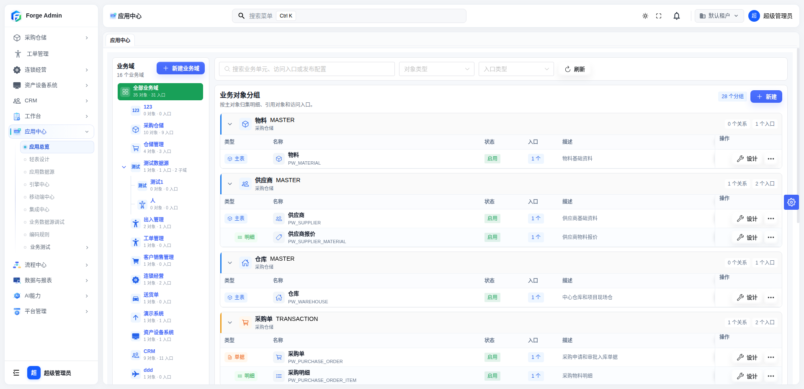

> 💡 进入应用中心：登录系统后，在左侧菜单点击「应用中心」即可进入低代码应用管理工作台。

---

## 二、创建业务域

业务域是组织业务对象的第一层容器，相当于一个业务模块的「命名空间」。

### 2.1 操作步骤

1. 进入 **应用中心**，左侧面板展示所有业务域列表
2. 点击左上角 **「新建业务域」** 按钮
3. 在弹出的抽屉面板中填写：

| 字段 | 说明 | 采购仓储示例 |
|------|------|-------------|
| 业务域名称 | 业务域的显示名称 | 采购仓储 |
| 业务域编码 | 大写字母+下划线，全局唯一 | `PROCUREMENT_WAREHOUSE` |
| 业务域图标 | 从图标库选择 | 📦 |
| 创建管理端目录 | 是否在系统菜单中创建对应目录 | 勾选 |
| 父级菜单 | 目录在系统菜单中的挂载位置 | 顶级 |
| 业务说明 | 描述业务域覆盖的业务范围 | 采购仓储模块，涵盖物料、供应商、采购、出入库管理 |

4. 点击 **「确定」** 保存

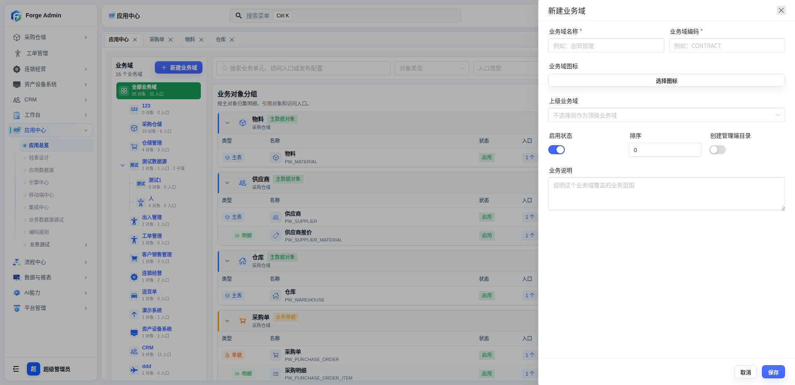

::: tip 业务域编码规则
编码使用大写字母+下划线格式（如 `PROCUREMENT_WAREHOUSE`），创建后不可修改。编码会作为业务对象和运行配置的前缀隔离标识。
:::

### 2.2 业务域层级

业务域支持父子层级结构。例如可以在「采购仓储」下创建子业务域：

- 采购仓储
  - 采购管理（子域）
  - 仓储管理（子域）
  - 供应商管理（子域）

点击业务域右侧的 **「⋯」** 菜单，选择「新增子业务域」即可。

---

## 三、创建业务对象

业务对象是低代码应用的核心，定义了一个数据实体的字段、表单、列表和关系。

### 3.1 新建业务对象

1. 在应用中心主区域，点击右上角 **「新建」** → 选择 **「新建业务对象」**
2. 弹出三步向导：

#### 第一步：选择业务域

| 选项 | 说明 |
|------|------|
| 选择已有业务域 | 从下拉列表选择已创建的业务域 |
| 新建业务域 | 如果对象不属于已有业务域，可在此快速创建 |

> 采购仓储示例：选择 `PROCUREMENT_WAREHOUSE`

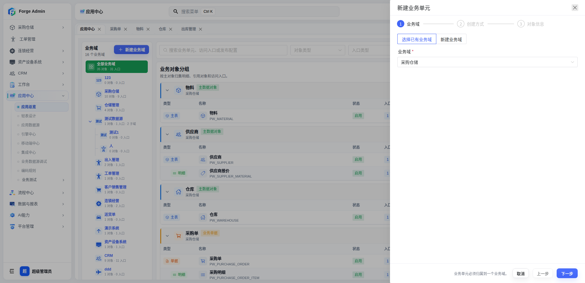

#### 第二步：选择创建方式

| 创建方式 | 说明 | 适用场景 |
|----------|------|---------|
| 数据库导入 | 选择已有数据表，自动解析字段 | 已有数据库表，快速创建对象 |
| 手动创建 | 从零开始定义字段 | 全新业务，尚无数据库表 |

选择「数据库导入」时，需要：

1. **运行数据源**：选择低代码运行数据源（从已配置的数据源列表中选择）
2. **数据表**：选择要导入的表（如 `pw_purchase_order`），系统自动解析表结构

> 采购仓储示例：采购单对象选择 `pw_purchase_order` 表导入

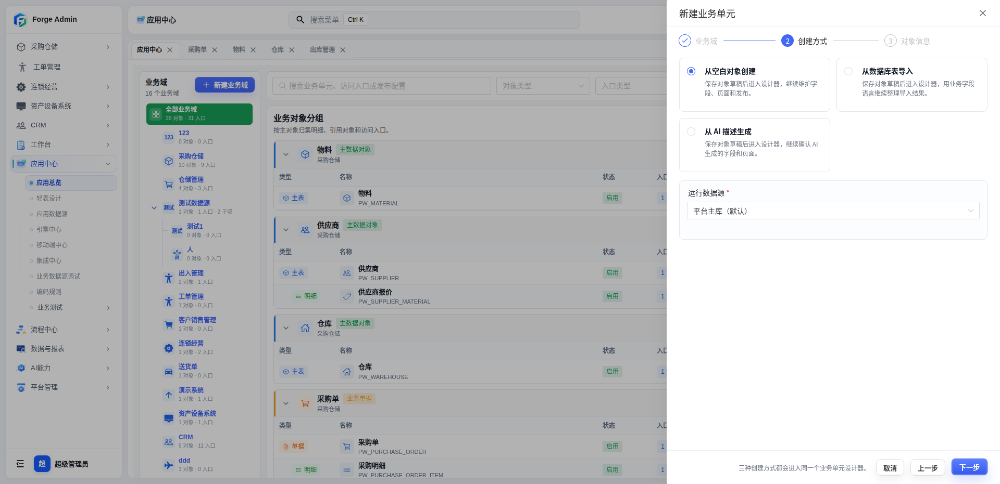

#### 第三步：填写对象信息

| 字段 | 说明 | 采购单示例 |
|------|------|-----------|
| 对象名称 | 对象的显示名称 | 采购单 |
| 对象编码 | 大写字母，业务域内唯一 | `PW_PURCHASE_ORDER` |
| 对象类型 | 标准 / 主子表 / 单据 | 单据 |
| 图标 | 从图标库选择 | 📋 |
| 启用状态 | 是否启用 | 启用 |
| 业务说明 | 描述对象的业务用途 | 采购订单，记录采购明细和审批流程 |

3. 点击 **「确定」** 完成创建

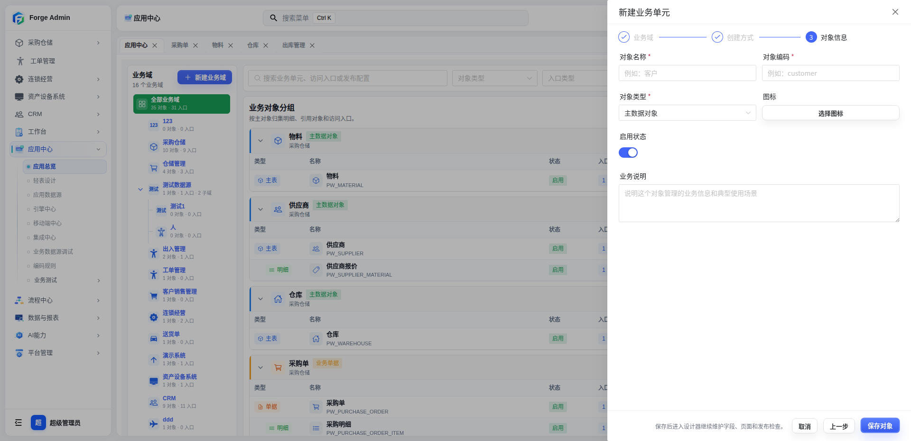

### 3.2 采购仓储模块的业务对象清单

采购仓储模块共创建了以下业务对象：

| 对象编码 | 对象名称 | 对象类型 | 数据表 |
|----------|---------|---------|--------|
| `PW_MATERIAL` | 物料 | 标准 | `pw_material` |
| `PW_SUPPLIER` | 供应商 | 主子表 | `pw_supplier` |
| `PW_WAREHOUSE` | 仓库 | 标准 | `pw_warehouse` |
| `PW_PURCHASE_ORDER` | 采购单 | 单据（主子表） | `pw_purchase_order` |
| `PW_OUTBOUND_ORDER` | 出库单 | 单据（主子表） | `pw_outbound_order` |
| `PW_TRANSFER_ORDER` | 调拨单 | 单据（主子表） | `pw_transfer_order` |
| `PW_SUPPLIER_MATERIAL` | 供应商物料报价 | 标准 | `pw_supplier_material` |

---

## 四、设计业务对象

创建业务对象后，点击对象卡片上的 **「设计」** 按钮进入对象设计器。设计器左侧导航包含以下面板：

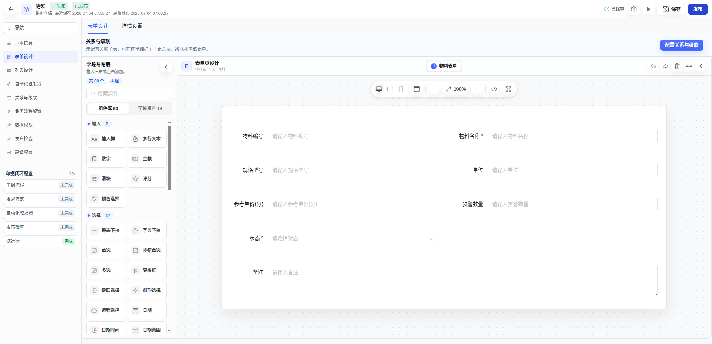

### 4.1 基本信息

进入设计器后默认展示「基本信息」面板，可修改对象名称、默认标题字段、启停状态等。

| 字段 | 说明 | 采购单示例 |
|------|------|-----------|
| 对象名称 | 显示名称 | 采购单 |
| 默认标题字段 | 列表和详情中作为标题展示的字段 | `purchaseNo` |
| 启用状态 | 是否启用 | 启用 |

### 4.2 高级字段资产

字段管理定义业务对象的数据字段。

1. 点击左侧导航 **「高级字段资产」** 进入字段管理
2. 数据库导入的对象会自动解析字段，你可以：

| 操作 | 说明 |
|------|------|
| 编辑字段 | 修改字段标签、数据类型、组件类型 |
| 设置必填 | 开启「必填」开关 |
| 设置字典 | 为状态类字段关联数据字典 |
| 配置校验 | 设置最大长度、正则校验等 |
| 隐藏字段 | 在表单中隐藏（如内部 ID 字段） |

> 采购单关键字段配置示例：
>
> | 字段编码 | 字段标签 | 组件类型 | 配置说明 |
> |----------|---------|---------|---------|
> | `purchaseNo` | 采购单号 | Input | 自动编号 `PO-{yyyyMMdd}-{seq4}` |
> | `projectName` | 项目名称 | Input | 必填 |
> | `warehouseId` | 目标仓库 | RecordSelector | 关联仓库对象，选择后回填仓库名称 |
> | `supplierId` | 供应商 | RecordSelector | 关联供应商对象，选择后回填供应商名称和联系人 |
> | `orderStatus` | 单据状态 | Input | 默认值 `DRAFT`，流程驱动自动变更 |
> | `purchaseAmountCent` | 采购金额 | InputNumber | 只读，明细汇总 |

::: warning 子表内部 ID 隐藏
子表中的 `id`、`xxxId` 等内部主键/外键字段默认在表单中隐藏（`formVisible: false`），由记录选择器自动回填。如需显示，可在字段属性中设置 `formVisible=true`。
:::

### 4.3 表单设计

表单设计器提供拖拽式布局能力。

1. 点击左侧导航 **「表单设计」** 进入表单设计器
2. 左侧为字段列表，中间为画布，右侧为属性面板
3. 从左侧拖拽字段到画布，支持：
   - 单列 / 双列 / 三列布局
   - 分组容器
   - 字段必填、只读、默认值设置
   - 字段联动规则配置


> 采购单表单布局建议：
> - **基本信息组**：采购单号、项目名称、采购日期、采购人
> - **供应商信息组**：供应商、联系人、联系电话
> - **仓库信息组**：目标仓库
> - **金额信息组**：采购金额（只读，自动汇总）
> - **其他信息组**：附件、备注

#### RecordSelector 字段

采购仓储模块大量使用 `RecordSelector` 类型字段，实现对象间的选择关联：

| 主表 | 字段 | 选择器数据源 | 回填字段 |
|------|------|-------------|---------|
| 采购单 | 目标仓库 | 仓库对象 | `warehouseId` + `warehouseName` |
| 采购单 | 供应商 | 供应商对象 | `supplierId` + `supplierName` + `supplierContact` + `supplierPhone` |
| 出库单 | 所属仓库 | 仓库对象 | `warehouseId` + `warehouseName` |
| 调拨单 | 调出仓库 | 仓库对象 | `fromWarehouseId` + `fromWarehouseName` |
| 调拨单 | 调入仓库 | 仓库对象 | `toWarehouseId` + `toWarehouseName` |

### 4.4 列表设计

列表设计器配置运行态列表页的搜索条件和表格列。

1. 点击左侧导航 **「列表设计」** 进入列表设计
2. 配置搜索条件：

| 配置项 | 说明 | 采购单示例 |
|--------|------|-----------|
| 搜索字段 | 列表上方的搜索栏字段 | 采购单号、项目名称、单据状态 |
| 搜索方式 | 精确匹配 / 模糊匹配 | 单号精确、名称模糊 |
| 隐藏字段 | 搜索条件中不显示但可传参 | `warehouseId`（供子表选择器使用） |

3. 配置表格列：

| 配置项 | 说明 | 采购单示例 |
|--------|------|-----------|
| 显示列 | 表格展示的字段 | 单号、项目、仓库、供应商、金额、状态 |
| 列宽 | 每列的最小宽度 | 单号 170px、金额 130px |
| 行动作 | 行级操作按钮 | 提交审批（成功后刷新列表） |

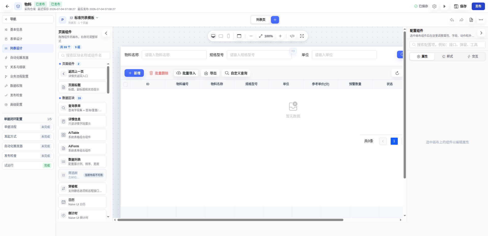

### 4.5 关系与级联

关系配置定义对象间的关联关系，是主子表和记录选择器的基础。

1. 点击左侧导航 **「关系与级联」** 进入关系设计器
2. 点击 **「新增关系」**，配置：

| 字段 | 说明 | 采购单→采购明细示例 |
|------|------|-------------------|
| 关系名称 | 关系的显示名称 | 采购明细 |
| 关系编码 | 关系标识 | `pw_purchase_order_item` |
| 关系类型 | 一对多 / 多对一 / 多对多 | 一对多 |
| 目标对象 | 关联的业务对象 | 采购明细 |
| 关联字段 | 外键字段 | `purchase_id` |
| 保存方式 | merge / replace | merge（增量保存） |
| 页签标题 | 详情页中的页签名称 | 采购明细 |

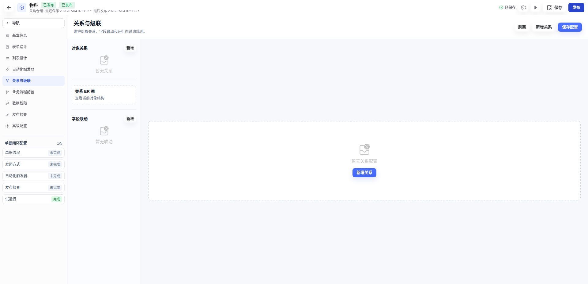

> 采购仓储的关系配置清单：
>
> | 主对象 | 关系名称 | 子对象 | 保存方式 |
> |--------|---------|--------|---------|
> | 供应商 | 供应商物料报价 | 供应商物料报价 | merge |
> | 采购单 | 采购明细 | 采购明细 | merge |
> | 出库单 | 出库明细 | 出库明细 | merge |
> | 调拨单 | 调拨明细 | 调拨明细 | merge |

::: tip merge 保存模式
`merge` 模式下，子表编辑时支持增量保存——新增行、修改行、删除行分别处理，无需整表替换。这对于大量明细行的场景更高效。
:::

### 4.6 记录选择器

记录选择器让子表行可以从其他对象批量选择记录并自动映射字段。

在关系配置中，可以为子表关系配置记录选择器：

| 配置项 | 说明 | 采购明细选择器示例 |
|--------|------|-------------------|
| 选择器对象 | 候选记录来源 | 供应商物料报价 |
| 按钮文字 | 选择器按钮的显示文字 | 选择报价 |
| 显示字段 | 候选列表展示的列 | 供应商、物料编号、物料名称、报价、有效期 |
| 关键词搜索 | 支持模糊搜索的字段 | `materialCode`、`materialName`、`supplierName` |
| 动态过滤条件 | 按上下文字段过滤候选记录 | `supplierId = ${formData.supplierId}` |
| 字段映射 | 选中的记录字段自动填入子表 | `materialId→materialId`、`materialName→materialName` 等 |

> 采购仓储的选择器配置：
>
> | 子表 | 选择器数据源 | 动态过滤条件 |
> |------|-------------|-------------|
> | 供应商物料报价 | 物料 | 无（全部可选） |
> | 采购明细 | 供应商物料报价 | `supplierId = ${formData.supplierId}` |
> | 出库明细 | 物料 | `warehouseId = ${formData.warehouseId}` |
> | 调拨明细 | 物料 | `fromWarehouseId = ${formData.fromWarehouseId}` |

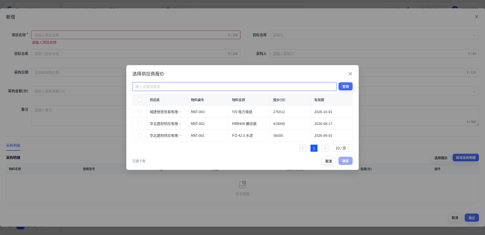

---

## 五、创建应用入口

业务对象设计完成后，需要创建应用入口，让用户可以在应用中心或系统菜单中访问。

### 5.1 新建应用入口

1. 在应用中心主区域，点击右上角 **「新建」** → 选择 **「新建应用入口」**
2. 弹出三步向导：

#### 第一步：选择场景

| 场景 | 说明 | 适用 |
|------|------|------|
| 数据管理 | 低代码运行页，基于业务对象的 CRUD | ✅ 采购仓储主要使用此场景 |
| 仪表盘 | 打开系统已有页面 | 用于统计概览 |
| 外部页面 | 内嵌或新窗口打开外部链接 | 集成第三方系统 |
| 移动入口 | H5 / 移动端业务 | 移动端访问 |

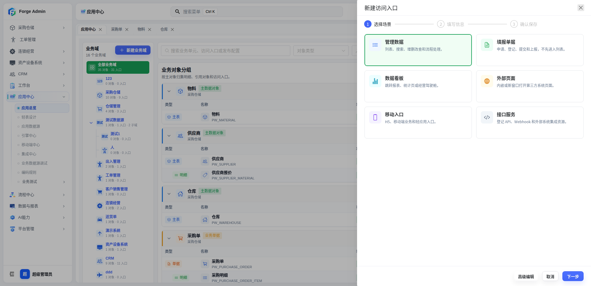

#### 第二步：填写信息

| 字段 | 说明 | 采购管理示例 |
|------|------|-------------|
| 入口名称 | 显示名称 | 采购管理 |
| 入口编码 | 唯一标识 | `PW_PURCHASE_MANAGE` |
| 所属业务域 | 下拉选择 | 采购仓储 |
| 关联业务单元 | 关联业务对象 | 采购单 |
| 图标 | 从图标库选择 | 🛒 |

#### 第三步：运行配置（数据管理场景）

| 字段 | 说明 | 采购管理示例 |
|------|------|-------------|
| 入口模式 | RUNTIME / CODE / EXTERNAL | RUNTIME |
| 运行打开方式 | 列表页 | 列表页 |
| 业务页面配置 | 自动带出 configKey | `pw_purchase_order` |

3. 点击 **「确定」** 保存

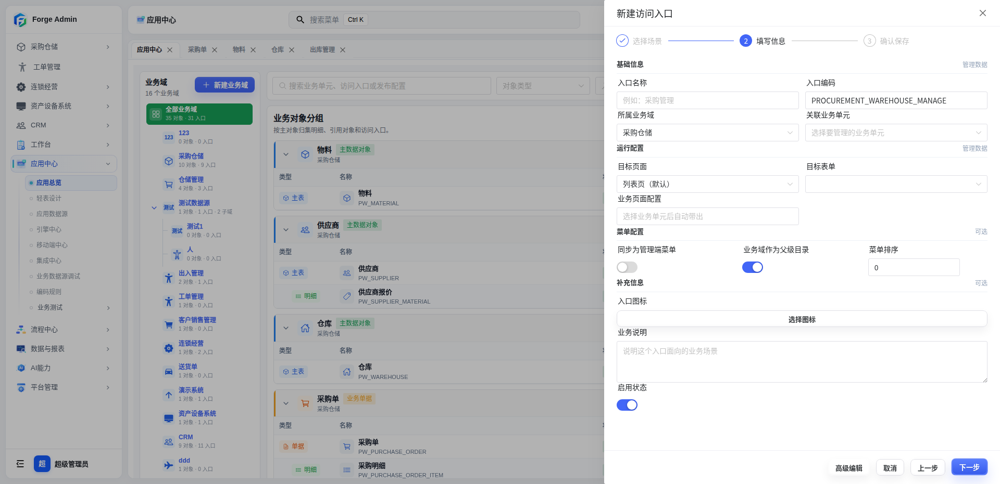

### 5.2 采购仓储的应用入口清单

| 入口名称 | 业务域 | 关联对象 | 场景 | 入口模式 |
|----------|--------|---------|------|---------|
| 物料管理 | 采购仓储 | 物料 | 数据管理 | RUNTIME |
| 供应商管理 | 采购仓储 | 供应商 | 数据管理 | RUNTIME |
| 仓储管理 | 采购仓储 | 仓库 | 数据管理 | RUNTIME |
| 采购管理 | 采购仓储 | 采购单 | 数据管理 | RUNTIME |
| 出库管理 | 采购仓储 | 出库单 | 数据管理 | RUNTIME |
| 调拨管理 | 采购仓储 | 调拨单 | 数据管理 | RUNTIME |

::: tip RUNTIME 模式
`RUNTIME` 模式下，运行态页面通过 `configKey` 读取已发布的 `ai_crud_config` 配置渲染，无需编写任何前端代码。采购仓储所有入口均使用此模式，实现完全低代码。
:::

---

## 六、绑定审批流程

对于需要审批的业务对象（如采购单、出库单、调拨单），需要配置单据流程。

### 6.1 业务流程配置面板

1. 进入业务对象设计器，点击左侧导航 **「业务流程配置」**
2. 在流程配置面板中完成以下设置：

#### 选择流程模型

从已发布的 Flowable 流程模型中选择。采购仓储三个单据对象统一使用 `leave_multi` 流程模型（通用多级审批流程）。

| 配置项 | 说明 | 采购单示例 |
|--------|------|-----------|
| 流程模型 | 从已发布流程中选择 | `leave_multi`（采购仓储通用审批流程） |
| 发起方式 | 流程启动方式 | `ACTION_ONLY`（仅动作触发） |
| 流程标题模板 | 流程实例的标题 | `采购单审批` |

#### 发起方式说明

| 方式 | 说明 | 采购仓储使用 |
|------|------|-------------|
| `BUTTON_ONLY` | 列表中点击「提交审批」按钮直接发起 | |
| `TRIGGER_ONLY` | 满足条件自动发起 | |
| `BOTH` | 手动 + 触发器 | |
| `ACTION_ONLY` | 由自动化动作的 START_FLOW 步骤发起 | ✅ |

> 采购仓储使用 `ACTION_ONLY` 模式，因为提交审批时需要先执行业务逻辑（如出库单先锁定库存），再发起流程。这种方式允许在发起流程前/后编排多个业务步骤。


#### 业务字段绑定

将业务字段映射为流程变量，供流程节点中的条件分支和表达式使用：

> 采购单的流程变量映射：
>
> | 业务字段 | 流程变量 | 说明 |
> |---------|---------|------|
> | `purchaseNo` | `documentNo` | 采购单号 |
> | `projectName` | `projectName` | 项目名称 |
> | `createBy` | `applicantId` | 申请人ID |
> | `orderStatus` | `documentStatus` | 单据状态 |
> | `purchaseAmountCent` | `amountCent` | 采购金额（分） |

未手动配置的字段，系统会自动按字段编码同名传递。

#### 回调动作配置

流程审批结果通过回调触发对应的自动化动作：

| 对象 | 审批通过回调 | 审批驳回回调 |
|------|------------|------------|
| 采购单 | `inbound_purchase_stock`（采购入库） | 无 |
| 出库单 | `commit_outbound_stock`（出库扣减） | `release_outbound_stock`（释放锁定） |
| 调拨单 | `transfer_stock`（调拨转移） | 无 |

### 6.2 单据配置

在「业务流程配置」面板中还可以配置单据驱动：

| 配置项 | 说明 | 采购单示例 |
|--------|------|-----------|
| 启用单据 | 开启单据流程驱动 | ✅ |
| 单据名称 | 单据的显示名称 | 采购单据 |
| 单据编号规则 | 自动编号格式 | `PO-{yyyyMMdd}-{seq4}` |
| 状态字段 | 驱动流程的状态字段 | `orderStatus` |
| 发起人字段 | 记录创建人 | `createBy` |
| 负责人字段 | 记录负责人 | `createBy` |
| 默认流程 Key | 绑定的流程模型 Key | `leave_multi` |

状态映射配置：

| 数据库状态值 | 流程状态值 | 说明 |
|-------------|-----------|------|
| `DRAFT` | DRAFT | 草稿 |
| `SUBMITTED` | SUBMITTED | 已提交 |
| `IN_PROCESS` | IN_PROCESS | 审批中 |
| `APPROVED` | APPROVED | 已通过 |
| `REJECTED` | REJECTED | 已驳回 |
| `CANCELED` | CANCELED | 已取消 |
| `CLOSED` | CLOSED | 已关闭 |

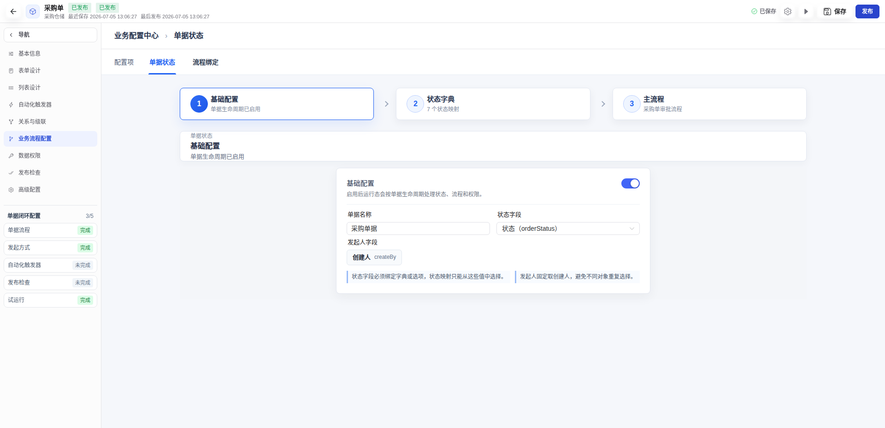

### 6.3 采购仓储的流程绑定清单

| 对象 | 流程 Key | 发起方式 | 审批通过 | 审批驳回 |
|------|---------|---------|---------|---------|
| 采购单 | `leave_multi` | ACTION_ONLY | 执行入库 | — |
| 出库单 | `leave_multi` | ACTION_ONLY | 执行扣减 | 释放锁定 |
| 调拨单 | `leave_multi` | ACTION_ONLY | 执行转移 | — |

::: warning 流程模型前置条件
绑定前需在「流程管理」中创建并发布对应的 Flowable 流程模型。流程模型定义审批节点、分支条件和审批人。`leave_multi` 是系统内置的通用多级审批流程，可直接使用。
:::

---

## 七、配置自动化动作

自动化动作是审批回调后自动执行的业务处理，是业务闭环的关键。

### 7.1 动作设计器

进入业务对象设计器 → **「业务处理」** 面板。

这里配置的是审批回调后要执行的业务动作。动作由「步骤序列」组成，每个步骤可以是：

| 步骤类型 | 说明 | 示例 |
|----------|------|------|
| `START_FLOW` | 发起审批流程 | 提交采购审批 |
| `FOREACH` | 遍历子表逐行处理 | 逐条明细入库 |
| `DOMAIN_ACTION` | 领域动作（数量台账等） | 入库、扣减、锁定、释放、转移 |
| `UPDATE_STATUS` | 更新单据状态 | 草稿 → 审批中 |

### 7.2 采购入库动作（FOREACH + QUANTITY/INBOUND）

采购单审批通过后，逐行遍历采购明细，执行入库动作：

**动作配置：**

| 配置项 | 值 |
|--------|---|
| 动作编码 | `inbound_purchase_stock` |
| 动作名称 | 采购入库过账 |
| 按钮位置 | 详情（DETAIL） |
| 动作类型 | COMMAND |
| 需要确认 | 是 |
| 成功消息 | "采购入库已写入数量台账" |
| 失败回滚 | `rollbackOnFailure = true` |

**执行步骤：**

```
步骤 1: FOREACH（逐行处理明细）
  ├─ collectionPath: record.children.pw_purchase_order_item
  ├─ itemAlias: item
  ├─ indexAlias: index
  └─ 子步骤:
      └─ DOMAIN_ACTION（明细入库）
          ├─ actionType: QUANTITY
          ├─ operationType: INBOUND
          └─ params:
              ├─ accountCode:    ${record.main.warehouseId}    （仓库账户）
              ├─ itemCode:       ${item.materialId}            （物料编码）
              ├─ dimensionKey:   ""                            （维度，空表示无维度）
              ├─ quantity:       ${item.quantity}              （入库数量）
              ├─ sourceDetailId: ${item.id}                    （来源明细ID）
              └─ remark:         采购审批通过入库
```

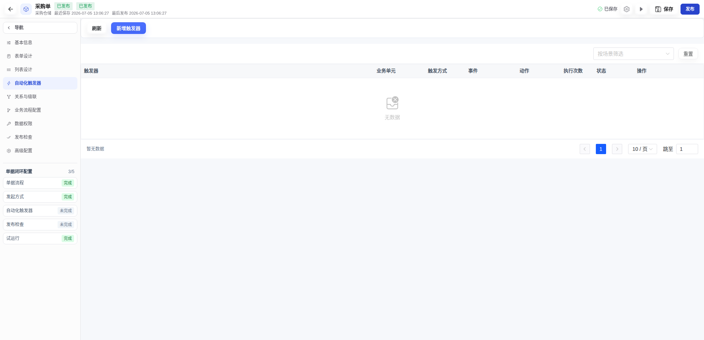

### 7.3 出库三阶段库存流转

出库单的库存流转最复杂，涉及三个阶段：

| 阶段 | 时机 | 操作 | 说明 |
|------|------|------|------|
| 锁定 | 提交审批时 | `QUANTITY/LOCK` | 锁定库存，防止超卖 |
| 扣减 | 审批通过时 | `QUANTITY/COMMIT` | 实际扣减库存，释放对应锁定 |
| 释放 | 审批驳回时 | `QUANTITY/RELEASE` | 释放已锁定库存 |

**提交审批动作（锁定 + 发起流程）：**

```
步骤 1: FOREACH（逐行锁定）
  ├─ collectionPath: record.children.pw_outbound_order_item
  └─ 子步骤: DOMAIN_ACTION / QUANTITY / LOCK
      ├─ accountCode:    ${record.main.warehouseId}
      ├─ itemCode:       ${item.materialId}
      ├─ quantity:       ${item.outboundQuantity}
      ├─ lockCode:       ${item.id}           （锁定编码，幂等键）
      ├─ sourceDetailId: ${item.id}
      └─ remark:         出库提交审批锁定

步骤 2: START_FLOW（发起审批）
  ├─ flowModelKey: leave_multi
  ├─ title: 出库单审批
  └─ staticValues: { approvalScene: "OUTBOUND" }
```

**审批通过回调（扣减）：**

```
FOREACH（逐行扣减）
  └─ DOMAIN_ACTION / QUANTITY / COMMIT
      ├─ accountCode:    ${record.main.warehouseId}
      ├─ itemCode:       ${item.materialId}
      ├─ quantity:       ${item.outboundQuantity}
      ├─ lockCode:       ${item.id}           （释放对应锁定）
      ├─ sourceDetailId: ${item.id}
      └─ remark:         出库审批通过扣减
```

**审批驳回回调（释放）：**

```
FOREACH（逐行释放）
  └─ DOMAIN_ACTION / QUANTITY / RELEASE
      ├─ accountCode:    ${record.main.warehouseId}
      ├─ itemCode:       ${item.materialId}
      ├─ lockCode:       ${item.id}
      └─ remark:         出库审批驳回释放锁定
```

> 注意：释放动作的 `rollbackOnFailure = false`，确保部分释放不会因个别失败而全部回滚。

### 7.4 调拨转移动作（FOREACH + QUANTITY/TRANSFER）

调拨单审批通过后，从调出仓库转移到调入仓库：

```
FOREACH（逐行转移）
  └─ DOMAIN_ACTION / QUANTITY / TRANSFER
      ├─ accountCode:        ${record.main.fromWarehouseId}  （调出仓库）
      ├─ itemCode:           ${item.materialId}
      ├─ targetAccountCode:  ${record.main.toWarehouseId}    （调入仓库）
      ├─ targetItemCode:     ${item.materialId}
      ├─ quantity:           ${item.transferQuantity}
      ├─ sourceDetailId:     ${item.id}
      └─ remark:             调拨审批通过转移
```

### 7.5 动作配置要点

::: tip 幂等键
每个数量动作的幂等键包含「对象编码 + 记录ID + 明细ID + 动作编码」，确保审批回调重复执行不会导致重复入库或重复扣减。
:::

::: warning FOREACH 事务控制
`FOREACH` 步骤默认在同一事务中执行。`rollbackOnFailure=true` 时任一子步骤失败会回滚整个 FOREACH。释放锁定动作设置 `rollbackOnFailure=false`，确保部分释放不会因个别失败而全部回滚。
:::

### 7.6 采购仓储动作清单

| 对象 | 动作编码 | 动作名称 | 位置 | 步骤概要 |
|------|---------|---------|------|---------|
| 采购单 | `submit_purchase_approval` | 提交审批 | 行（ROW） | START_FLOW |
| 采购单 | `inbound_purchase_stock` | 采购入库过账 | 详情（DETAIL） | FOREACH → QUANTITY/INBOUND |
| 出库单 | `submit_outbound_approval` | 提交审批并锁定库存 | 行（ROW） | FOREACH → QUANTITY/LOCK → START_FLOW |
| 出库单 | `commit_outbound_stock` | 出库扣减过账 | 详情（DETAIL） | FOREACH → QUANTITY/COMMIT |
| 出库单 | `release_outbound_stock` | 释放出库锁定 | 详情（DETAIL） | FOREACH → QUANTITY/RELEASE |
| 调拨单 | `submit_transfer_approval` | 提交审批 | 行（ROW） | START_FLOW |
| 调拨单 | `transfer_stock` | 调拨转移过账 | 详情（DETAIL） | FOREACH → QUANTITY/TRANSFER |

---

## 八、详情页配置

详情页展示业务对象的完整信息，包括主信息、关联数据页签和数量台账区块。

### 8.1 主信息展示

详情页的主信息自动复用表单设计的布局，以只读模式展示，无需重复配置。

### 8.2 关联数据页签

在「关系与级联」中配置的关系会自动出现在详情页中，以页签形式展示。此外，可以在「详情设置」中配置额外的页签区块：

> 仓库详情页的页签配置：
> - 库存余额（数量台账区块 - `quantity-balance`）
> - 数量流水（数量台账区块 - `quantity-ledger`）
> - 数量锁定（数量台账区块 - `quantity-lock`）
> - 采购记录（API 关联表 - `table`）
> - 出库记录（API 关联表 - `table`）
> - 调出记录（API 关联表 - `table`）
> - 调入记录（API 关联表 - `table`）

### 8.3 数量台账区块

数量台账区块是详情页中的特殊组件，直接读取通用数量台账服务：

| 区块类型 | 说明 | 数据源 | 参数 |
|----------|------|--------|------|
| `quantity-balance` | 库存余额 | 数量台账服务 | `accountCode=${row.id}` |
| `quantity-ledger` | 数量流水 | 数量台账服务 | `accountCode=${row.id}` |
| `quantity-lock` | 数量锁定 | 数量台账服务 | `accountCode=${row.id}` |

> 物料详情页也可以配置数量区块，按 `itemCode` 过滤：
> - 库存信息（`quantity-balance`，参数 `itemCode=${row.id}`）
> - 近 3 次出入库（`quantity-ledger`，参数 `itemCode=${row.id}`，pageSize=3）

### 8.4 API 关联表区块

除了数量台账，详情页还支持配置 API 关联表区块，通过调用其他对象的列表 API 展示关联数据：

| 配置项 | 说明 | 仓库→采购记录示例 |
|--------|------|------------------|
| 区块类型 | `table` | |
| 标题 | 页签名称 | 采购记录 |
| 数据源类型 | `api` | |
| API | 接口地址 | `get@/ai/crud/pw_purchase_order/page` |
| 参数映射 | 接口参数与当前记录的字段映射 | `warehouseId=${row.id}` |
| 数据字段 | 返回数据的列表字段名 | `records` |
| 列配置 | 表格列定义 | 采购单号、供应商、金额、状态 |

### 8.5 描述信息区块

详情页还支持 `descriptions` 类型区块，以描述列表形式展示字段信息：

> 采购单详情页的供应商信息区块：
> - 区块类型：`descriptions`
> - 标题：供应商信息
> - 列数：3
> - 字段：供应商名称、联系人、联系电话


---

## 九、发布检查与发布

### 9.1 发布检查

发布前需通过发布检查。进入设计器 → **「发布检查」** 面板：

检查项分为以下几个维度：

| 检查维度 | 说明 | 常见问题 |
|----------|------|---------|
| 字段检查 | 字段定义是否完整 | 必填字段未设置、字段类型不匹配 |
| 页面检查 | 表单和列表配置是否完整 | 表单未配置字段、列表缺少搜索条件 |
| 关系检查 | 关系配置是否完整 | 主子表关系缺少外键字段 |
| 数据表检查 | 数据表结构是否同步 | 新增字段未同步到数据库 |
| 运行配置检查 | CRUD 配置是否完整 | API 配置缺失、权限标识未设置 |

每个检查项按严重程度分级：

| 级别 | 说明 |
|------|------|
| ERROR | 阻断项，必须修复才能发布 |
| WARN | 警告项，建议修复但不阻断发布 |
| INFO | 提示项，供参考 |

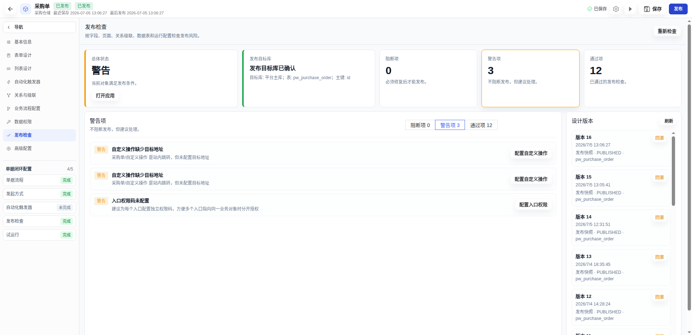

### 9.2 发布操作

1. 发布检查无阻断项后，点击右上角 **「发布」** 按钮
2. 如有「同步数据表结构」选项，勾选后系统会自动将新增字段同步到数据库
3. 发布成功后，对象状态变为「已发布」

::: tip 发布后生效
发布后，运行态页面会立即使用最新配置。用户刷新页面即可看到变更。
:::

### 9.3 单据闭环配置检查

设计器左侧导航底部有「单据闭环配置」检查清单，直观展示闭环状态：

| 步骤 | 说明 | 检查条件 |
|------|------|---------|
| 单据流程 | 是否已配置流程 | `documentEnabled + statusField + mainFlow.configured` |
| 发起方式 | 是否配置发起 | `startMode` 不为空 |
| 自动化触发器 | 触发器是否配置 | 按发起方式判断是否需要 |
| 发布检查 | 是否通过发布检查 | `publishable = true` |
| 试运行 | 是否可打开运行 | `canOpen = true` |

每个步骤显示 ✅（完成）、⚠️（待处理）或 ⬜（未开始）状态，点击可跳转到对应面板。


---

## 十、全流程测试

### 10.1 测试环境准备

1. 确保后端服务（端口 8580）和前端（端口 3000）已启动
2. 确保数据库已执行 Flyway 迁移（含采购仓储 seed 数据）
3. 确保 `leave_multi` 流程模型已在流程管理中发布

### 10.2 基础数据准备

登录系统后，先准备基础数据：

| 步骤 | 操作 | 说明 |
|------|------|------|
| 1 | 进入物料管理 | 新增 3-5 个物料（如：钢筋、水泥、砂石） |
| 2 | 进入供应商管理 | 新增 2 个供应商，并在子表「供应商报价」中为每个供应商添加物料报价 |
| 3 | 进入仓储管理 | 新增 2 个仓库（如：中心仓、项目现场仓） |

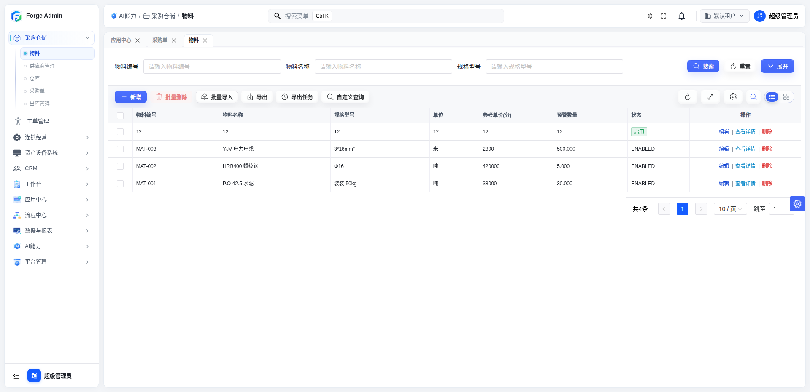

### 10.3 采购流程测试

| 步骤 | 操作 | 预期结果 |
|------|------|--------|
| 1 | 进入采购管理，点击「新增」 | 打开采购单表单 |
| 2 | 填写项目名称、采购日期，通过 RecordSelector 选择仓库和供应商 | 选择后自动回填仓库名称、供应商名称和联系人 |
| 3 | 在采购明细子表中点击「选择报价」 | 弹出记录选择器，仅显示当前供应商的物料报价 |
| 4 | 选择 2-3 条报价，确认 | 明细行自动填入物料编号、名称、规格、单位、成本单价、成交单价 |
| 5 | 填写采购数量，保存 | 采购单创建成功，单号自动生成（如 `PO-20260705-0001`） |
| 6 | 在列表中点击该采购单的「提交审批」 | 弹出确认提示「确认提交采购审批？」 |
| 7 | 确认提交 | 单据状态变为「审批中」，流程实例创建 |
| 8 | 进入流程管理，处理待办任务，点击「同意」 | 审批通过 |
| 9 | 回到采购管理，查看该采购单状态 | 状态变为「已通过」 |
| 10 | 进入仓储管理，打开仓库详情 | 查看库存余额页签，应显示刚入库的物料和数量 |
| 11 | 查看数量流水页签 | 有一条入库流水，来源为采购单 |

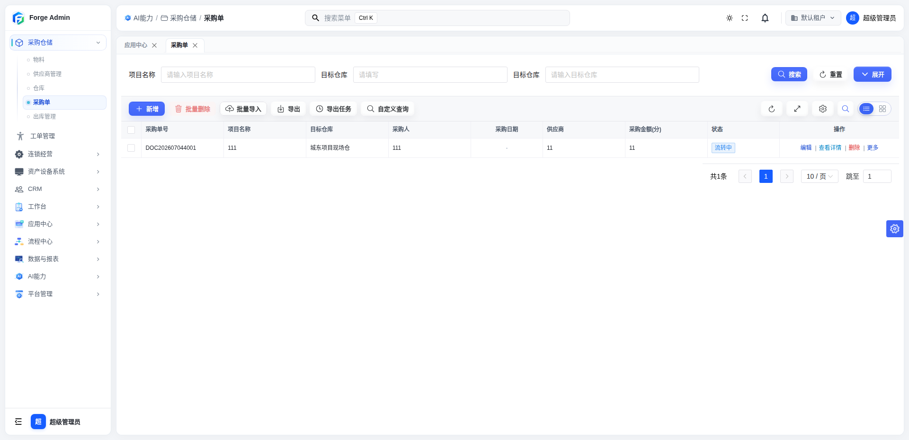

### 10.4 出库流程测试

| 步骤 | 操作 | 预期结果 |
|------|------|--------|
| 1 | 进入出库管理，点击「新增」 | 打开出库单表单 |
| 2 | 通过 RecordSelector 选择仓库（上一步入库的仓库） | 仓库选择正常 |
| 3 | 在出库明细子表中点击「选择物料」 | 弹出选择器，仅显示该仓库有库存的物料 |
| 4 | 选择物料，填写出库数量 | 明细行自动填入物料信息 |
| 5 | 保存 | 出库单创建成功，单号自动生成（如 `OUT-20260705-0001`） |
| 6 | 点击「提交审批并锁定」 | 弹出确认提示 |
| 7 | 确认提交 | 库存被锁定，单据状态变为「审批中」 |
| 8 | 进入流程管理处理待办 | |
| 8a | 点击「同意」 | 审批通过，库存扣减，锁定释放 |
| 8b | （可选）点击「驳回」 | 审批驳回，锁定释放，库存恢复 |
| 9 | 回到仓库详情，查看库存余额 | 余额已扣减（或锁定已释放） |
| 10 | 查看数量流水 | 流水记录显示入库、锁定、扣减/释放的完整链路 |
| 11 | 查看数量锁定页签 | 审批中时显示锁定记录，审批后锁定记录消失 |

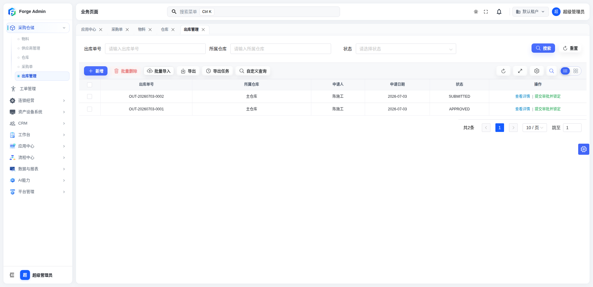

### 10.5 调拨流程测试

| 步骤 | 操作 | 预期结果 |
|------|------|--------|
| 1 | 进入调拨管理，点击「新增」 | 打开调拨单表单 |
| 2 | 通过 RecordSelector 分别选择调出仓库和调入仓库 | 两个仓库不能相同 |
| 3 | 在调拨明细子表中选择物料，填写调拨数量 | 明细行显示当前库存 |
| 4 | 保存并点击「提交审批」 | 单据状态变为「审批中」 |
| 5 | 流程审批通过 | |
| 6 | 查看调出仓库库存 | 余额减少 |
| 7 | 查看调入仓库库存 | 余额增加 |
| 8 | 查看调出仓库的数量流水 | 有一条调出流水 |
| 9 | 查看调入仓库的数量流水 | 有一条调入流水 |

### 10.6 数量台账验证

进入仓储管理 → 打开仓库详情，逐项验证：

| 验证项 | 检查内容 |
|--------|--------|
| 库存余额 | 物料编号、名称、当前库存、锁定数量是否正确 |
| 数量流水 | 入库、出库、调拨的流水记录是否完整，每条流水有来源单据标识 |
| 数量锁定 | 提交审批后的锁定记录是否正确，审批完成后锁定是否释放 |
| 流水来源 | 每条流水是否能追溯到来源单据（通过 `sourceDetailId`） |

进入物料管理 → 打开物料详情，还可以按物料维度查看：
| 验证项 | 检查内容 |
|--------|--------|
| 库存信息 | 该物料在各仓库的库存余额 |
| 供应商报价 | 该物料各供应商的报价记录 |
| 近 3 次出入库 | 最近的流水记录 |

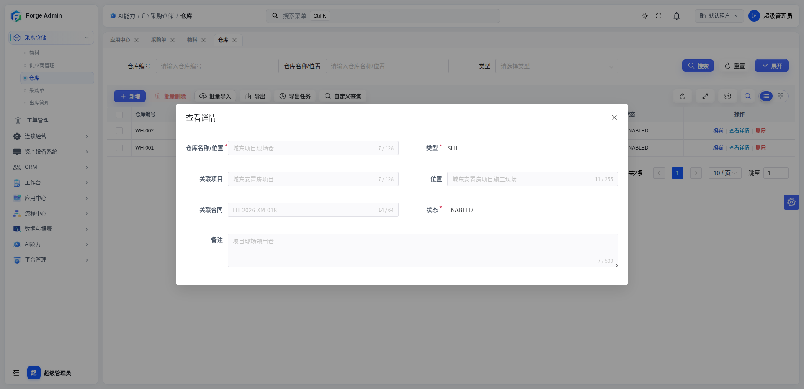

---

## 十一、常见问题

### Q1: 应用入口创建后打开白屏？

1. 检查业务对象是否已「发布」
2. 检查 `configKey` 是否正确指向 `ai_crud_config` 记录
3. 检查运行数据源是否正确配置
4. 查看浏览器控制台是否有报错
5. 检查后端日志是否有 CRUD 配置解析异常

### Q2: 记录选择器弹出后没有数据？

1. 检查选择器数据源对象是否有数据
2. 检查动态过滤条件表达式是否正确（如 `${formData.supplierId}`）
3. 检查当前用户是否有该对象的数据权限
4. 检查关键词搜索字段配置是否支持多字段
5. 检查选择器的 `searchParams` 中是否有隐式过滤条件导致结果为空

### Q3: 提交审批后流程没有启动？

1. 检查流程模型是否已发布（流程管理中状态应为「已发布」）
2. 检查 `flowModelKey` 是否与流程模型的 Key 一致（采购仓储使用 `leave_multi`）
3. 检查单据配置的 `statusField` 和状态映射是否正确
4. 查看后端日志是否有流程启动异常
5. 检查 `START_FLOW` 步骤的 `fieldMapping` 是否正确传递了必填的流程变量

### Q4: 审批通过后库存没有变化？

1. 检查自动化动作的执行场景是否匹配（`APPROVED` 回调）
2. 检查 `FOREACH` 的 `collectionPath` 是否正确指向子表关系编码（如 `record.children.pw_purchase_order_item`）
3. 检查 `DOMAIN_ACTION` 的参数表达式是否正确（如 `${item.materialId}`、`${item.quantity}`）
4. 查看后端日志中 `BusinessActionExecutionService` 的执行记录
5. 检查幂等键是否因重复执行被跳过
6. 检查 `accountCode` 和 `itemCode` 是否正确引用了仓库ID和物料ID

### Q5: 出库提交后库存没有锁定？

1. 检查「提交审批并锁定」动作的步骤序列是否正确（FOREACH → LOCK → START_FLOW）
2. 检查 `QUANTITY/LOCK` 的 `lockCode` 是否设置了唯一标识（`${item.id}`）
3. 检查仓库详情页的「数量锁定」页签是否有锁定记录
4. 如果锁定失败，检查 `rollbackOnFailure` 是否为 `true`（锁定步骤失败应回滚整个提交）

### Q6: 审批驳回后出库锁定没有释放？

1. 检查流程绑定中的驳回回调动作是否配置（`REJECTED → release_outbound_stock`）
2. 检查 `QUANTITY/RELEASE` 动作的 `lockCode` 是否与锁定时的 `lockCode` 一致
3. 检查释放动作的 `rollbackOnFailure` 是否为 `false`（部分释放失败不应回滚）
4. 查看后端日志中释放动作的执行记录

---

## 附录：采购仓储数据库表一览

| 表名 | 说明 | 类型 |
|------|------|------|
| `pw_material` | 物料 | 主表 |
| `pw_supplier` | 供应商 | 主表 |
| `pw_supplier_material` | 供应商物料报价 | 主表 |
| `pw_warehouse` | 仓库 | 主表 |
| `pw_purchase_order` | 采购单 | 主表 |
| `pw_purchase_order_item` | 采购明细 | 子表（外键 `purchase_id`） |
| `pw_outbound_order` | 出库单 | 主表 |
| `pw_outbound_order_item` | 出库明细 | 子表（外键 `outbound_id`） |
| `pw_transfer_order` | 调拨单 | 主表 |
| `pw_transfer_order_item` | 调拨明细 | 子表（外键 `transfer_id`） |

## 附录：低代码配置数据表一览

| 表名 | 说明 |
|------|------|
| `ai_lowcode_domain` | 低代码业务域 |
| `ai_lowcode_model` | 低代码数据模型 |
| `ai_business_suite` | 业务域（设计器） |
| `ai_business_object` | 业务对象（设计器） |
| `ai_business_object_relation` | 业务对象关系 |
| `ai_business_app` | 应用入口 |
| `ai_crud_config` | CRUD 运行配置 |
| `ai_business_document_config` | 单据配置 |
| `ai_business_binding` | 流程绑定 |
| `ai_business_action` | 自动化动作 |
| `ai_business_quantity_balance` | 数量台账余额 |
| `ai_business_quantity_ledger` | 数量台账流水 |
| `ai_business_quantity_lock` | 数量台账锁定 |
