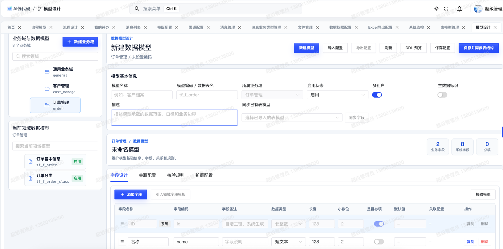
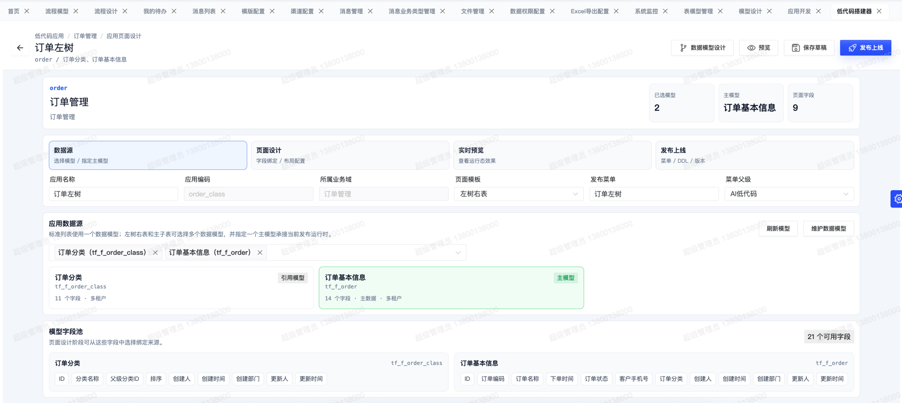
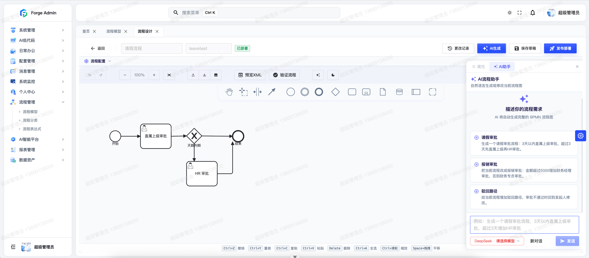
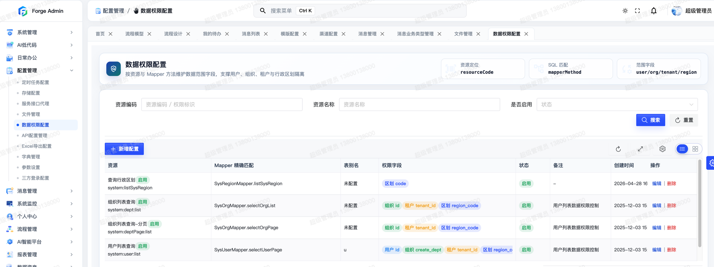
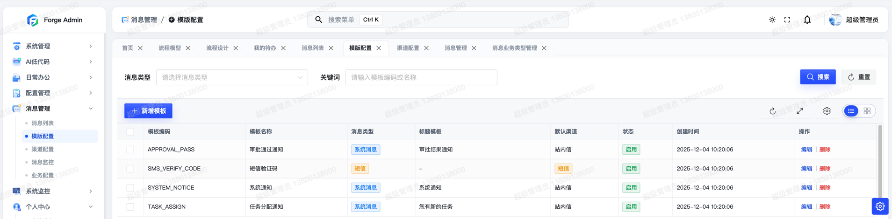

# 把低代码、工作流、AI 做进一个框架是什么体验？聊聊我开源的 Forge Admin

> 一个 Java 程序员的私心：我不想每接一个后台项目，就重新搭一遍多租户、权限、审批流和代码生成。

做了七八年后台开发，我发现一个规律：**90% 的企业后台，在重复造同样的轮子。**

用户、角色、菜单、字典、文件、日志——每个项目都要搭一遍。好不容易搭完基础，业务需求又来了：要多租户、要审批流、要数据大屏、要快速出 CRUD 页面。于是又开始翻 Flowable 文档、对接 AI 接口、写代码生成器……

后来我把这些"每次都要重来一遍"的东西，沉淀成了一个框架，开源了出来，叫 **Forge Admin**。

它不是又一个"后台管理脚手架"。和市面上常见的框架比，它想解决的是三件更难的事：**让搭页面更快（低代码）、让流程能闭环（工作流）、让 AI 真正长进开发链路（AI 能力）**。这篇就把这三块讲透。

> 先放一张项目首页镇楼，账号 `admin` / `123456` 直接进演示站体验：

*▲ 后台工作台：系统状态、业务指标、常用入口集中展示*

---

## 一、低代码：协议驱动，不是"生成一坨代码"

先说最容易被误解的低代码。

### 多数框架的低代码：生成代码，然后呢？

市面上多数低代码框架的路线是：在线配表单 → 一键生成前后端代码 → 你手工 Merge 到项目里。问题在哪？**生成的是代码文件**。你改完想再生成，就要处理冲突；代码风格取决于生成器版本；页面和代码死死绑在一起。改一个字段，要动 Entity、DTO、VO、Mapper、Vue 五六个文件。

### Forge 的路线：协议驱动

Forge 走的是另一条路——**协议驱动**。它的核心是一套 JSON Schema 协议：

- `modelSchema` 定义数据模型（有哪些字段、什么类型、什么约束）
- `pageSchema` 定义页面编排（表格列、搜索项、表单、按钮、接口）

低代码的最终产物**不是代码，是一份 JSON 协议**。页面由运行时引擎按协议动态渲染。这意味着：

> 改配置，页面直接变。页面和代码彻底解耦，不存在"改了再生成要合并冲突"这回事。

落到实际开发，一个标准的 CRUD 页面（带搜索、分页、表单、增删改查接口），过去要写 Controller、Service、Mapper、Vue 页面，大概两天。用 Forge 的 `AiCrudPage`，配一份 api-config + schema，**10 分钟就能跑起来**。

### 从数据模型到页面，全程可视化

第一步，在浏览器里设计数据模型，不用碰 SQL：

*▲ ModelDesigner：拖字段、定类型、设约束，可视化设计数据模型*

第二步，AI 或可视化设计器生成表单和列表：

*▲ 一句话描述需求，AI 生成表单结构*

*▲ 生成后还能继续拖拽微调，控件、校验、布局都可视化*

第三步，低代码应用直接搭建运行：

*▲ 低代码应用开发：模型 + 页面协议驱动，配置即业务*

### 复杂业务也有退路

当然，复杂业务不可能纯配置。所以 Forge 留了两条路：

- **简单业务**：纯配置，0 代码上线
- **复杂业务**：AI 生成配置 JSON（AiCrudConfig）→ Velocity 模板渲染成规范代码包 → 下载二次开发

*▲ 模板市场：复杂业务可下载规范代码包，二次开发*

一句话概括 Forge 的低代码哲学：**AI 帮你把配置写好，模板帮你把代码写好，运行时帮你把页面渲染好。**

---

## 二、工作流：原生 Flowable，审批从发起到时间轴全闭环

第二块是工作流。

很多框架的"工作流"是 Demo 级的——给你一个请假审批的例子，真到自己接业务，发现节点审批人怎么动态算、流程怎么和业务数据绑定、审批记录怎么追溯，全是坑。

Forge 直接集成了 **Flowable 7.0**（BPMN 2.0 标准工作流引擎），把审批业务做成了完整闭环。

### 在线流程设计：BPMN + 钉钉双模式

*▲ 流程模型管理：版本、状态、部署一目了然*

*▲ 在线 BPMN 设计器，拖拽画流程；另有钉钉风格审批流设计器，业务人员也能看懂*

### 完整审批闭环

| 环节 | Forge 提供什么 |
|------|----------------|
| 流程设计 | 在线 BPMN 设计器 + 钉钉风格审批流设计器，双模式 |
| 流程发起 | `@FlowStart` 注解，业务代码一行发起流程 |
| 待办审批 | 我的待办、通过 / 驳回 / 转办，移动端 H5 也能审批 |
| 审批人计算 | SpEL 表达式动态计算审批人（按部门负责人、按金额分级等） |
| 流程追溯 | 流程时间轴，谁在什么时候做了什么一目了然 |
| 业务绑定 | `@FlowBind` / `@FlowCallback`，流程结果回调业务 |

审批人怎么处理待办：

*▲ 待办中心：通过 / 驳回 / 转办，一站式处理*

流程怎么追溯：

*▲ 流程时间轴：谁、什么时候、做了什么，全程可追溯*

最实用的是**审批人动态计算**。比如"金额 > 1 万走总监审批，否则部门主管即可"这种规则，不用写死在代码里，用 SpEL 表达式配置即可。

请假、采购、合同、报销、工单——这些需要流程编排的业务，接进来基本是配置 + 少量回调代码的事。

---

## 三、AI 能力：不做聊天助手，做"长进开发链路"的 AI

第三块，也是我最想讲的——AI。

现在很多框架都加了 AI，但仔细看，多数是"贴上去的"：一个独立的对话助手模块，帮你聊聊天、查查知识库。AI 是个外围功能，跟你的开发流程没关系。

Forge 的 AI 是**长进核心链路**的，干两件实事。

### 1. AI 驱动低代码 / 代码生成

你用自然语言描述需求 → AI 生成数据模型和低代码配置 JSON → 运行时引擎直接渲染页面，或下载规范代码包。

*▲ 从"我想要一个客户管理模块，有姓名、电话、跟进状态"，到能跑的页面*

AI 在这里不是"加速器"，**它本身就是开发流程的一环**。

### 2. AI 数据可视化大屏（Forge Report）

这是项目里一个独立的低代码大屏平台。你可以：

- 用自然语言描述业务目标，让 AI 生成大屏草稿
- 再用可视化编辑器调组件、改主题、接数据源
- 一键发布成可访问页面

*▲ 大屏项目管理：保存、发布、预览*

*▲ 拖拽式画布编辑器，图层、组件、数据源、主题全可视化*

内置组件很全：柱状图、折线图、饼图、雷达图、中国地图、词云、滚动表格、数字翻牌、装饰边框……而且**支持接真实业务 API**（静态数据 / 动态 HTTP / 数据池），不是只能看 Mock 数据的花架子。

### 多 AI 供应商统一接入

不绑定单一模型。OpenAI、DeepSeek、通义千问（阿里百炼）、智谱 GLM、Moonshot（Kimi）、Ollama 本地模型，以及任何兼容 OpenAI API 格式的服务，统一接入、随时切换。

*▲ 多 AI 供应商统一接入，随时切换*

还做了熔断器（AI 服务挂了不拖垮系统）、客户端缓存、流式输出这些工程化考虑。

---

## 四、除了这三块，企业级地基也打牢了

光有亮点不够，企业后台真正难的是"地基"。Forge 把这些都做进了底层 Starter。

### 权限：菜单、按钮、数据三层都管

*▲ 菜单管理：动态路由、目录、按钮权限、资源绑定*

*▲ 数据权限：按组织、角色、业务规则配置数据范围，降低越权风险*

数据权限这块下了狠功夫：**7 种数据范围**（全部 / 本人 / 本组织 / 组织及子组织 / 自定义 / 租户全部 / 行政区划），而且是在 **Mapper 层用 SQL 改写**实现的——不在 Service 层加过滤条件，而是直接改写你 SQL 的 WHERE 子句。好处是无论你怎么写 SQL，权限都绕不过去，政府项目常见的行政区划权限也原生支持。

### 多租户：做 SaaS 不用改每个 Mapper

很多人用若依做 SaaS 时踩过这个坑：原生没有租户概念，要给每个查询手动加 `where tenant_id = ?`，改到第 30 个 Mapper 手指都在抖。

Forge 的多租户是 **SQL 层自动注入 + 五级忽略策略**：

| 优先级 | 策略 | 解决什么 |
|--------|------|----------|
| 1 | 上下文标记 | 运行时动态切换租户 |
| 2 | 配置白名单 | 17 张系统表自动忽略 |
| 3 | 手动注册 | 代码级临时加忽略表 |
| 4 | 自动扫描 | 引入无 tenant_id 的第三方表不报错 |
| 5 | 注解驱动 | `@IgnoreTenant` + 切面 |

引第三方表没有 tenant_id 字段？自动跳过注入，不报错。这是工程上很省心的设计。

### 接口安全：金融政务场景够用

- **接口加解密**：RSA 密钥协商 + SM4/AES 会话加密，敏感接口传输全程加密
- **防重放**：nonce 机制 + 缓存校验
- **分布式幂等**：三套策略——STRICT（严格拒绝重复，适合支付）、RETURN_CACHE（返回缓存，适合查询）、TOKEN_REQUIRED（先拿 Token 再提交，适合表单）

### 运维：上线后能排查、能治理

*▲ 服务监控：CPU、内存、磁盘等运行指标*

操作日志、定时任务、服务监控、缓存管理、文件存储——这些上线后才用得到的运维能力，全部开箱即用。

### 消息中心：审批、通知、模板统一入口

*▲ 消息中心：站内信、系统通知、消息模板统一管理*

### 架构：微内核 + 插件化

技术能力沉到 Starter（auth / tenant / orm / crypto / excel / file 等 20 个），业务能力做成 Plugin（system / generator / flow / message / ai 等）。引入即生效，按需组合，长期二开不会越写越乱。

*▲ 微内核 + 插件化：Starter 管技术能力，Plugin 管业务能力*

---

## 五、移动端也没落下

审批、待办、消息这些场景，手机上处理才是高频。Forge 提供独立的移动端 H5，基于 **uni-app + Vue3**，一套代码同时发布 H5、微信小程序、支付宝小程序。审批流程、待办提醒、消息通知在手机上即可完成闭环。

*▲ 移动端 H5：首页工作台、消息中心、流程待办、个人中心*

---

## 六、技术栈和适用场景

**技术栈**：

- 后端：Java 17 + Spring Boot 3.2 + MyBatis-Plus + Sa-Token + Flowable 7.0
- 前端：Vue 3.5 + Naive UI + Vite 7 + Pinia + UnoCSS
- 移动端：uni-app（H5 / 小程序一套代码多端）

**适合谁用**：

| 场景 | 为什么选 Forge |
|------|----------------|
| SaaS 多租户后台 | 多租户 + 数据权限深度集成 |
| 审批流业务（OA / 采购 / 合同 / 工单） | Flowable 全闭环 |
| 数据大屏 / 驾驶舱 | AI 生成 + 真实数据接入 |
| 快速交付业务页面 | 协议驱动低代码 + AI 配置 |
| 金融 / 政务高安全场景 | 接口加解密 + 数据权限 |

**说点实在的短板**：作为一个相对年轻的开源项目，Forge 的社区和教程数量还不如若依、Jeecg 这些老牌项目多，新手部署需要读一下文档。如果你希望满网找现成教程，这点要先有预期。但如果你做长期产品、愿意读文档，这套地基能帮你省很多重复劳动。

---

## 七、上手体验

光说不练假把式，直接上演示地址（账号 `admin` / `123456`）：

- **后台管理演示**：http://www.dlforgelab.com:8084/forge/login
- **AI 大屏演示**：http://www.dlforgelab.com:8084/forge-report/
- **移动端 H5**：http://www.dlforgelab.com:8084/forge-h5/ （账号 `h5_admin` / `123456`）
- **项目文档**：http://www.dlforgelab.com:8084/forge-docs/

**源码地址**：

- Gitee：https://gitee.com/ForgeLab/forge-admin
- GitHub：https://github.com/yaomindong1996/forge-admin

本地跑起来也简单：克隆 → 初始化数据库（有一键脚本）→ 改下数据库配置 → 后端 `mvn spring-boot:run`、前端 `pnpm dev`，默认 `admin` / `123456` 登录。

---

> 开源不易，持续迭代更难。如果这个项目对你有用，点个 Star 是对作者最大的鼓励 ⭐
>
> 你现在做后台用的什么框架？最头疼的是多租户、审批流还是代码生成？评论区聊聊，我会挨个回复。

